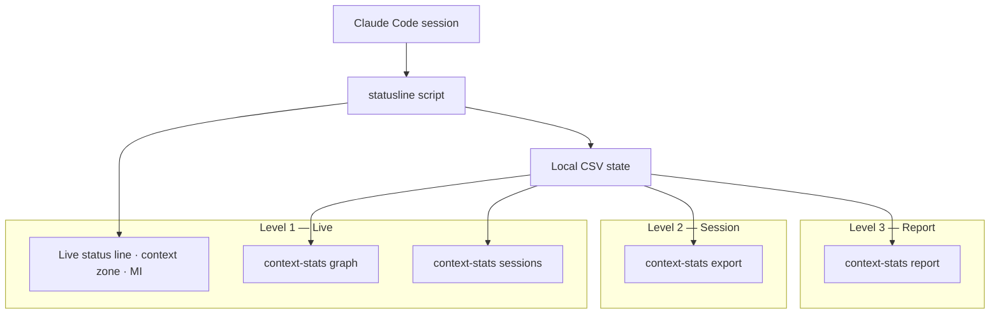

<div align="center">
  

  <h1>Understand how you use Claude Code — and spend less doing it.</h1>

[](https://pypi.org/project/context-stats/)
[](https://pypi.org/project/context-stats/)
[](https://github.com/luongnv89/cc-context-stats)
[](https://opensource.org/licenses/MIT)

Three levels of analytics — live session awareness, per-session deep dives, and multi-week cost reports — so you can use Claude Code at its best and know exactly where your tokens go.

[**Get Started →**](#installation)
</div>

---

## Three Levels of Stats



| Level | Tool | What you learn |
|---|---|---|
| **Live** | Status line + graph dashboard + sessions list | Context zone, MI score, token delta — act now, not after it's too late |
| **Session** | `context-stats export` | Cache efficiency, interaction timeline, zone history for one session |
| **Report** | `context-stats report` | Cost breakdown, cache analysis, cross-project patterns across weeks or months |

---

## Level 1: Live Stats

### Status Line

A single line in your Claude Code terminal updated on every refresh:

```
my-project | main [3] | 64,000 free (32.0%) | Code | MI:0.918 | +2,500 | Opus 4.6 | abc-123
```

| Element | What it tells you |
|---|---|
| `64,000 free (32.0%)` | Available tokens and utilization |
| `Code` | Context zone — color-coded action signal |
| `MI:0.918` | Model Intelligence score — how sharp the model still is |
| `+2,500` | Tokens consumed since last refresh |

When the terminal is narrow, lower-priority elements drop off in order — the project name is always shown.

| Green status | Warning state |
|:---:|:---:|
|  |  |

### Context Zones

Five zones tell you exactly what to do next:

| Zone | Color | Meaning | Action |
|---|:---:|---|---|
| Planning | Green | Plenty of room | Keep planning and coding |
| Code-only | Yellow | Context tightening | Finish current task, no new plans |
| Dump | Orange | Quality declining | Wrap up and prepare to export |
| ExDump | Dark red | Near hard limit | Start a new session |
| Dead | Gray | Exhausted | Stop — nothing productive left |

Thresholds are **model-size-aware**: 1M context models use absolute token counts; standard models use utilization ratios. Both are configurable.

| Plan zone | Code zone | Dump zone |
|:---:|:---:|:---:|
|  |  |  |

### Model Intelligence (MI)

MI estimates how well Claude performs at the current fill level, calibrated from the MRCR v2 8-needle benchmark:

```
MI(u) = max(0, 1 - u^β)
```

| Model | β | MI at 50% | MI at 75% |
|---|---|---|---|
| Opus 4.6 | 1.8 | 0.713 | 0.404 |
| Sonnet 4.6 | 1.5 | 0.646 | 0.350 |
| Haiku 4.5 | 1.2 | 0.565 | 0.292 |

Color-coded: **green** (>0.70), **yellow** (0.40–0.70), **red** (<0.40 — start a new session). Override with `mi_curve_beta=1.5` in config.

### Session Listing

Find and switch between active sessions:

```bash
context-stats sessions                  # Sessions from the last 5 minutes
context-stats sessions --minutes 30     # Widen the search window
```

Each session shows the project name, model, token count, and how recently it was active.

### Live Graph Dashboard

```bash
context-stats graph                     # Context growth for the latest session
context-stats graph --type all          # All graphs
context-stats <session_id> graph        # Specific session
```

| Graph | What it answers |
|---|---|
| `delta` | How many tokens each interaction consumed |
| `cumulative` | Total context used over the session |
| `cache` | Cache creation and read tokens, with 5-min TTL countdown |
| `mi` | How MI degraded across the session |
| `io` | Input/output token breakdown |

Auto-refreshes every 2 seconds. Pass `-w 5` to slow down or `--no-watch` to show once.

| Context growth | Cumulative graph | Cache activity |
|:---:|:---:|:---:|
|  |  |  |

| MI over time |
|:---:|
|  |

---

## Level 2: Session Report

Export a full deep-dive when you need to understand what happened in a specific session:

```bash
context-stats export --output report.md              # Latest session
context-stats <session_id> export --output report.md  # Specific session
```

| Section | What you learn |
|---|---|
| Executive Snapshot | Model, project, duration, interactions, final zone |
| Cache Activity | Cache creation vs. read ratio — did your session reuse the cache? |
| Interaction Timeline | Per-interaction context, MI score, and zone history |
| Visual Charts | Mermaid charts: context growth, zones, cache, token composition |
| Key Takeaways | Short read of what changed |

Example output:

```markdown
## Executive Snapshot
| Signal | Value | Why it matters |
|--------|-------|----------------|
| Model | claude-sonnet-4-6 | Which model produced the session |
| Duration | 59m 32s | Relate context growth to session length |
| Interactions | 135 | How active the session was |
| Final usage | 129,755 (64.9%) | How close the session got to the limit |
| Final zone | Dump zone | Whether the session stayed in a safe range |
```

See the full example in [`context-stats-export-output.md`](context-stats-export-output.md).

### Cache Keep-Warm

Claude's prompt cache has a ~5 minute TTL. Keep it alive during pauses to avoid expensive cache misses:

```bash
context-stats cache-warm on 30m              # Latest session
context-stats <session_id> cache-warm on 30m  # Specific session
```

```bash
context-stats cache-warm off
```

Heartbeats fire every 4 minutes. Runs as a detached background process.

---

## Level 3: Usage Report

Aggregate token usage and cost across **all** Claude Code projects and sessions:

```bash
context-stats report                     # All time
context-stats report --since-days 30     # Last 30 days
context-stats report --output report.md  # Write to file
```

The report is a Markdown file with these sections:

| Section | What you learn |
|---|---|
| Executive Summary | Total spend, sessions, projects, cache hit ratio, avg session cost, most expensive project |
| Model Usage Breakdown | Cost and token share per model family (Opus / Sonnet / Haiku) with pie chart |
| Cost Optimization | Top 10 costliest sessions, sessions with low cache efficiency, high-spend projects |
| Cost Efficiency | Overall cache hit ratio, tokens per dollar, most and least efficient sessions |
| Daily Activity Heatmap | Sessions by day-of-week and hour — see when you code and how that affects cost |
| Weekly Trend | Spend and session count per week with charts |
| Code Productivity | Lines changed per dollar and per 1k tokens across projects |
| Projects Table | Per-project: sessions, cost, % of total, tokens, cache hit %, avg cost, dominant model |

Example executive summary:

```markdown
| Metric | Value |
|--------|-------|
| Report Period | 2026-03-08 → 2026-04-07 |
| Total Spend | $6,413.24 |
| Total Sessions | 764 |
| Projects Analyzed | 58 |
| Cache Hit Ratio | 46.9% |
| Avg Session Cost | $8.39 |
| Avg Session Duration | 2h 1m 8s |
| Most Expensive Project | agent-skill-manager ($1,204.58, 18.8% of total) |
```

Cache reads cost ~10x less than input tokens. Sessions with low cache hit ratios are flagged in the optimization section so you know exactly where to cut costs.

---

## Installation

```bash
pip install context-stats
```

```bash
uv pip install context-stats
```

Add to Claude Code settings:

```json
{
  "statusLine": {
    "type": "command",
    "command": "claude-statusline"
  }
}
```

Restart Claude Code. The status line, graph dashboard, session export, and report all read the same local state files.

---

## Customization

```bash
# ~/.claude/statusline.conf
color_project_name=bright_cyan
color_branch_name=bright_magenta
color_mi_score=#ff9e64
show_mi=true
show_delta=true
token_detail=true
```

Full palette: 18 named colors + any `#rrggbb` hex.

```bash
cp examples/statusline.conf ~/.claude/statusline.conf
```

---

## FAQ

**Is it free?**
Yes. MIT licensed, zero external dependencies.

**Does it send my data anywhere?**
No. Session data stays local in `~/.claude/statusline/`. Analytics read from `~/.claude/projects/`.

**What runtimes does it support?**
Python 3.9+. Install via `pip install context-stats`.

---

## Get Started

```bash
pip install context-stats
```

[Read the docs](docs/installation.md) · [View export example](context-stats-export-output.md) · MIT Licensed

---

<details>
<summary><strong>Documentation</strong></summary>

- [Installation Guide](docs/installation.md) - Platform-specific setup
- [Context Stats Guide](docs/context-stats.md) - Detailed CLI usage guide
- [Configuration Options](docs/configuration.md) - All settings explained
- [Available Scripts](docs/scripts.md) - Script variants and features
- [Model Intelligence](docs/MODEL_INTELLIGENCE.md) - MI formula, per-model profiles, benchmark data
- [Architecture](docs/ARCHITECTURE.md) - System design and components
- [CSV Format](docs/CSV_FORMAT.md) - State file field specification
- [Development](docs/DEVELOPMENT.md) - Dev setup, testing, and debugging
- [Deployment](docs/DEPLOYMENT.md) - Publishing and release process
- [Troubleshooting](docs/troubleshooting.md) - Common issues and solutions
- [Changelog](CHANGELOG.md) - Version history

</details>

<details>
<summary><strong>Contributing</strong></summary>

Contributions are welcome. Read [CONTRIBUTING.md](CONTRIBUTING.md) for development setup, branching, and PR process.

This project follows the [Contributor Covenant Code of Conduct](CODE_OF_CONDUCT.md).

</details>

<details>
<summary><strong>How It Works (Architecture)</strong></summary>

Context Stats hooks into Claude Code's status line feature to track token usage across sessions. The Python statusline script writes state data to local CSV files, which the `context-stats` CLI reads to render live graphs. Data is stored locally in `~/.claude/statusline/` and never sent anywhere.

Claude Code invokes the statusline script via stdin JSON pipe — the script reads JSON from stdin and writes formatted text to stdout. The `report` subcommand reads Claude Code's own project logs from `~/.claude/projects/` to aggregate cross-session analytics.

</details>

<details>
<summary><strong>Migration from cc-statusline</strong></summary>

If you were using the previous `cc-statusline` package:

```bash
pip uninstall cc-statusline
```

```bash
pip install context-stats
```

The `claude-statusline` command still works. The main change is `token-graph` is now `context-stats`.

</details>

## License

MIT

<p align="center">
  <a href="https://github.com/luongnv89/claude-howto">claude-howto</a> ·
  <a href="https://github.com/luongnv89/asm">asm</a> ·
  <a href="https://custats.info">custats.info</a>
</p>
