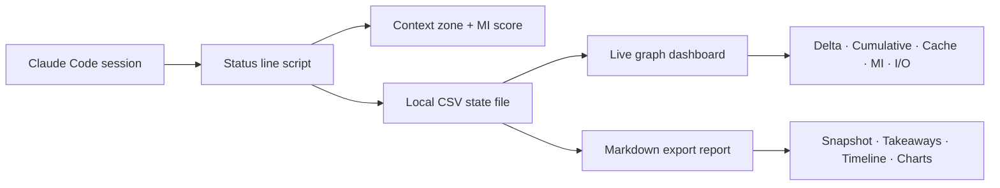
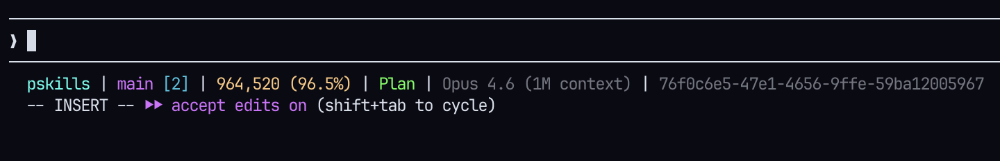
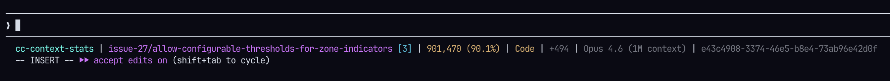
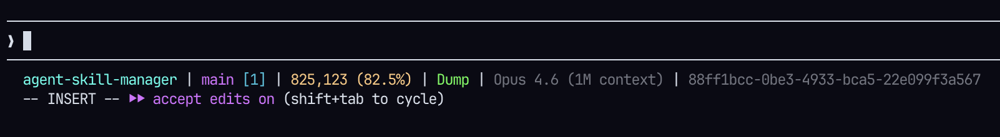
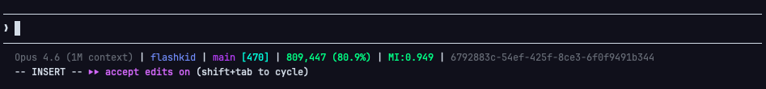
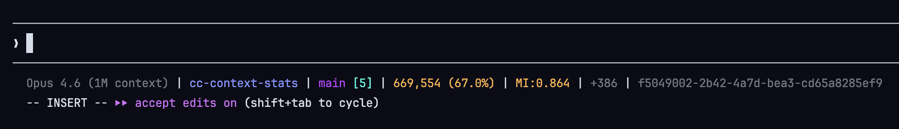
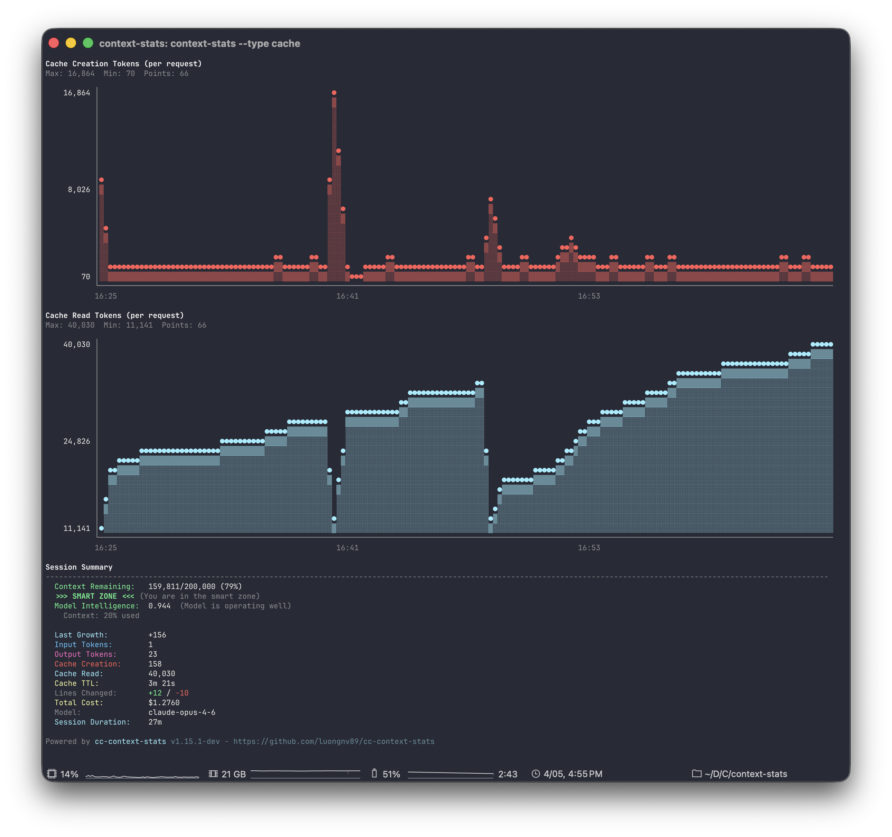

<div align="center">
  

  <h1>Know your context zone. Act before Claude degrades.</h1>

[](https://pypi.org/project/cc-context-stats/)
[](https://www.npmjs.com/package/cc-context-stats)
[](https://pypi.org/project/cc-context-stats/)
[](https://www.npmjs.com/package/cc-context-stats)
[](https://github.com/luongnv89/cc-context-stats)
[](https://opensource.org/licenses/MIT)

Real-time context window monitoring for Claude Code. Five zones tell you exactly what to do next — keep coding, finish up, export your session, or restart.

[**Get Started →**](#installation-and-configuration)
</div>

---

## How It Works



1. Claude Code pipes session JSON to the status line script on every refresh.
2. The script computes zone, Model Intelligence (MI) score, and displays a compact status line.
3. The CLI reads the local state file for live charts and exportable session reports.
4. Everything stays local in `~/.claude/statusline/`.

---

## Context Zones

Five zones with a clear action for each:

| Zone | Color | Meaning | Do this now |
|---|:---:|---|---|
| Planning | Green | Plenty of room | Keep planning and coding |
| Code-only | Yellow | Context tightening | Finish the current task, no new plans |
| Dump | Orange | Quality declining | Wrap up and prepare to export |
| ExDump | Dark red | Near hard limit | Start a new session |
| Dead | Gray | Exhausted | Stop — nothing productive left |

Thresholds are **model-size-aware**: 1M context models use absolute token counts (70k/100k/250k/275k); standard models use utilization ratios (40%/70%/75%). Both are configurable.

| Plan zone | Code zone | Dump zone |
|:---:|:---:|:---:|
|  |  |  |

---

## Status Line

A single line in your Claude Code terminal that shows everything at a glance:

```
my-project | main [3] | 64,000 free (32.0%) | Code | MI:0.918 | +2,500 | Opus 4.6 | abc-123
```

| Element | What it tells you |
|---|---|
| `my-project` | Current directory |
| `main [3]` | Git branch + uncommitted changes |
| `64,000 free (32.0%)` | Available tokens and utilization |
| `Code` | Current context zone (color-coded) |
| `MI:0.918` | Model Intelligence score — how sharp the model still is |
| `+2,500` | Tokens consumed since last refresh |
| `Opus 4.6` | Active model |
| `abc-123` | Session ID (double-click to copy) |

When the terminal is narrow, lower-priority elements drop off in order — the project name is always shown.

| Green status | Warning state |
|:---:|:---:|
|  |  |

### Rich Customization

Every element has its own color key. Override per-property or set hex values:

```bash
# ~/.claude/statusline.conf
color_project_name=bright_cyan
color_branch_name=bright_magenta
color_mi_score=#ff9e64
color_green=#7dcfff
color_yellow=#e0af68
color_red=#f7768e
show_mi=true
show_delta=true
token_detail=true
```

Full palette: 18 named colors + any `#rrggbb` hex. Per-property colors override base color slots; base slots override built-in defaults. Copy the annotated example to get started:

```bash
cp examples/statusline.conf ~/.claude/statusline.conf
```

---

## Model Intelligence (MI)

MI estimates how well Claude performs at the current context fill level. It is a single number from 0.000 to 1.000 calibrated from the **MRCR v2 8-needle** long-context retrieval benchmark.

```
MI(u) = max(0, 1 - u^β)
```

Each model family has a measured beta:

| Model | β | MI at 50% | MI at 75% |
|---|---|---|---|
| Opus 4.6 | 1.8 | 0.713 | 0.404 |
| Sonnet 4.6 | 1.5 | 0.646 | 0.350 |
| Haiku 4.5 | 1.2 | 0.565 | 0.292 |

Color-coded: **green** (>0.70, operating well), **yellow** (0.40–0.70, pressure building), **red** (<0.40, start new session). Override the curve with `mi_curve_beta=1.5` in config.

---

## Live Graph Dashboard

```bash
context-stats <session_id> graph               # Context growth per interaction (default)
context-stats <session_id> graph --type all    # All graphs
```

| Graph | What it answers |
|---|---|
| `delta` | How many tokens each interaction consumed |
| `cumulative` | Total context used over the session |
| `cache` | Cache creation and read tokens over time, with 5-min TTL countdown |
| `mi` | How MI degraded across the session |
| `io` | Input/output token breakdown |
| `both` | Cumulative + delta side by side |

Auto-refreshes every 2 seconds (flicker-free). Pass `-w 5` to slow it down or `--no-watch` to show once.

| Context growth | Cumulative graph | Cache activity |
|:---:|:---:|:---:|
|  |  |  |

| MI over time |
|:---:|
|  |

---

## Cache Keep-Warm

Claude's prompt cache has a ~5 minute TTL. A background heartbeat prevents expensive cache misses during pauses.

```bash
# Start keep-warm for 30 minutes
context-stats <session_id> cache-warm on 30m

# Stop it
context-stats <session_id> cache-warm off
```

Heartbeats fire every 4 minutes (under the 5-min TTL). Runs as a detached background process on Unix, subprocess fallback on Windows. State tracked in `~/.claude/statusline/cache-warm.<session_id>.json`.

---

## Session Export

Export a full session report when you need the timeline, charts, and analysis in one Markdown file:

```bash
context-stats <session_id> export --output report.md
```

| Section | Contents |
|---|---|
| Generate | Copyable command to regenerate this report |
| Executive Snapshot | Model, project, duration, interactions, final zone, cache activity |
| Summary | Window size, token totals, cost, final MI |
| Key Takeaways | Short read of what changed |
| Visual Summary | Mermaid charts: context, zones, cache, composition |
| Interaction Timeline | Per-interaction context, MI, and zone history |

Example output:

```markdown
## Executive Snapshot
| Signal | Value | Why it matters |
|--------|-------|----------------|
| Session | `8bb55603-...` | Link back to source session |
| Project | claude-howto | Identify where the report came from |
| Model | claude-sonnet-4-6 | See which model produced the session |
| Duration | 59m 32s | Relate context growth to session length |
| Interactions | 135 | Show how active the session was |
| Final usage | 129,755 (64.9%) | See how close the session got to the limit |
| Final zone | Dump zone | See whether the session stayed in a safe range |
```

See the full example in [`context-stats-export-output.md`](context-stats-export-output.md).

---

## Installation and Configuration

### Shell script (recommended)

```bash
curl -fsSL https://raw.githubusercontent.com/luongnv89/cc-context-stats/main/install.sh | bash
```

### npm

```bash
npm install -g cc-context-stats
```

### Python (pip)

```bash
pip install cc-context-stats
```

### Python (uv)

```bash
uv pip install cc-context-stats
```

### Claude Code setup

Add to your Claude Code settings:

```json
{
  "statusLine": {
    "type": "command",
    "command": "claude-statusline"
  }
}
```

Restart Claude Code. The status line and dashboard both read the same local state files.

---

## FAQ

**Is it free?**
Yes. MIT licensed, zero external dependencies.

**Does it send my data anywhere?**
No. Session data stays local in `~/.claude/statusline/`.

**What runtimes does it support?**
Shell (Bash + jq), Python 3, and Node.js. All three read the same config; Python and Node.js also write state files for the CLI.

---

## Get Started

```bash
curl -fsSL https://raw.githubusercontent.com/luongnv89/cc-context-stats/main/install.sh | bash
```

[Read the docs](docs/installation.md) · [View export example](context-stats-export-output.md) · MIT Licensed

---

<details>
<summary><strong>Documentation</strong></summary>

- [Installation Guide](docs/installation.md) - Platform-specific setup (shell, pip, npm)
- [Context Stats Guide](docs/context-stats.md) - Detailed CLI usage guide
- [Configuration Options](docs/configuration.md) - All settings explained
- [Available Scripts](docs/scripts.md) - Script variants and features
- [Model Intelligence](docs/MODEL_INTELLIGENCE.md) - MI formula, per-model profiles, benchmark data
- [Architecture](docs/ARCHITECTURE.md) - System design and components
- [CSV Format](docs/CSV_FORMAT.md) - State file field specification
- [Development](docs/DEVELOPMENT.md) - Dev setup, testing, and debugging
- [Deployment](docs/DEPLOYMENT.md) - Publishing and release process
- [Troubleshooting](docs/troubleshooting.md) - Common issues and solutions
- [Changelog](CHANGELOG.md) - Version history

</details>

<details>
<summary><strong>Contributing</strong></summary>

Contributions are welcome. Read [CONTRIBUTING.md](CONTRIBUTING.md) for development setup, branching, and PR process.

This project follows the [Contributor Covenant Code of Conduct](CODE_OF_CONDUCT.md).

</details>

<details>
<summary><strong>How It Works (Architecture)</strong></summary>

Context Stats hooks into Claude Code's status line feature to track token usage across sessions. The Python and Node.js statusline scripts write state data to local CSV files, which the `context-stats` CLI reads to render live graphs. Data is stored locally in `~/.claude/statusline/` and never sent anywhere.

The statusline is implemented in three languages (Bash, Python, Node.js) so you can choose whichever runtime you have available. Claude Code invokes the statusline script via stdin JSON pipe — any implementation that reads JSON from stdin and writes formatted text to stdout works.

</details>

<details>
<summary><strong>Migration from cc-statusline</strong></summary>

If you were using the previous `cc-statusline` package:

```bash
pip uninstall cc-statusline
```

```bash
pip install cc-context-stats
```

The `claude-statusline` command still works. The main change is `token-graph` is now `context-stats`.

</details>

## License

MIT

<p align="center">
  <a href="https://github.com/luongnv89/claude-howto">claude-howto</a> ·
  <a href="https://github.com/luongnv89/asm">asm</a> ·
  <a href="https://custats.info">custats.info</a>
</p>
