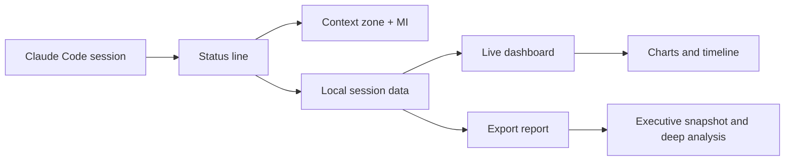

<div align="center">
  

  <h1>See the current context zone and act fast</h1>

[](https://pypi.org/project/cc-context-stats/)
[](https://www.npmjs.com/package/cc-context-stats)
[](https://pypi.org/project/cc-context-stats/)
[](https://www.npmjs.com/package/cc-context-stats)
[](https://github.com/luongnv89/cc-context-stats)
[](https://opensource.org/licenses/MIT)

  <p><strong>Status line zones for Claude Code, with the next task to do in each state.</strong><br/>Know when to keep coding, finish up, export the session, or restart fresh.</p>

  <table>
    <tr>
      <th>Current zone</th>
      <th>Do this now</th>
    </tr>
    <tr>
      <td>Planning</td>
      <td>Keep planning and coding</td>
    </tr>
    <tr>
      <td>Code-only</td>
      <td>Finish the current task</td>
    </tr>
    <tr>
      <td>Dump zone</td>
      <td>Export the session and wrap up</td>
    </tr>
    <tr>
      <td>ExDump</td>
      <td>Start a new session now</td>
    </tr>
    <tr>
      <td>Dead zone</td>
      <td>Stop and restart fresh</td>
    </tr>
  </table>

  <p>
    <a href="https://github.com/luongnv89/claude-howto">claude-howto</a> ·
    <a href="https://github.com/luongnv89/asm">asm</a> ·
    <a href="https://custats.info">custats.info</a>
  </p>

[**Get Started →**](#installation-and-configuration)
</div>

---

## What It Gives You

| Need | What cc-context-stats shows |
|---|---|
| Statusline with context zone | Planning, Code-only, Dump, ExDump, and Dead at a glance |
| Export report with deep analysis | Snapshot, takeaways, charts, and timeline in Markdown |
| Live context monitoring | Current usage, MI, delta, cumulative growth, and cache activity |

## How It Works



1. Claude Code emits session state on every refresh.
2. The status line turns it into a zone, context, and MI signal.
3. The CLI reads local session data for live charts and exportable reports.
4. Everything stays local on disk.

## Status Line

The status line is the fastest way to see whether a session is still healthy.

| Zone | Meaning | What to do |
|---|---|---|
| Planning | Plenty of room left | Keep planning and coding |
| Code-only | Context is getting tighter | Finish the current task |
| Dump zone | Quality is slipping | Wrap up soon |
| ExDump | Near the hard limit | Start a new session |
| Dead zone | No useful headroom left | Stop and restart |

**Plan zone**


**Code zone**


**Dump zone**


## Live Monitoring

The CLI gives you the full session picture when the status line is not enough.

| Chart | What it answers |
|---|---|
| Context trend | How fast the session is filling up |
| Model Intelligence | How quickly quality is degrading as context grows |
| Zone distribution | Where the session spent most of its time |
| Final context composition | How much of the final request was cache, reads, or new input |
| Cache activity trend | When cache creation and cache reads changed over time, with TTL countdown |

| Status bar view | Context growth | Cumulative graph |
|:---:|:---:|:---:|
|  |  |  |

| Cumulative graph | Cache graph |
|:---:|:---:|
|  |  |

| MI view | Status bar warning state |
|:---:|:---:|
|  |  |

Each image shows a different slice of the same session:

- `statusline-green.png` shows the compact status line when the model is still sharp.
- `1.10-delta.png` shows growth at each interaction.
- `1.10-cumulative.png` shows overall context usage over time.
- `1.10.0-model-intelligence.png` shows the MI view as context pressure rises.
- `1.10-statusline.png` shows the warning state when the session is getting tight.
- `1.16-cache.png` shows cache creation and read tokens per request with a TTL countdown.

## Export Report

Export a session when you want the timeline, charts, and summary in one Markdown file.

```bash
context-stats export <session_id> --output report.md
```

The report starts with the command that produced it, then folds the headline facts into an executive snapshot.

| Section | What it contains |
|---|---|
| Generate | Copyable export command |
| Executive Snapshot | Session, project, model, duration, interactions, final usage, final zone, cache activity |
| Summary | Window size, final usage, token totals, cost, and final MI |
| Key Takeaways | The short read of what changed in the session |
| Visual Summary | Mermaid charts for context, zones, cache, and composition |
| Interaction Timeline | Per-interaction context, MI, and zone history |

Example output:

```markdown
# Context Stats Report

## Generate

    context-stats export 8bb55603-45b8-4bdf-aa04-d51366610b1a --output report.md

## Executive Snapshot
| Signal | Value | Why it matters |
|--------|-------|----------------|
| **Session** | `8bb55603-45b8-4bdf-aa04-d51366610b1a` | Link back to the source session |
| **Project** | **claude-howto** | Identify where the report came from |
| **Model** | **claude-sonnet-4-6** | See which model produced the session |
| **Duration** | **59m 32s** | Relate context growth to session length |
| **Interactions** | **135** | Show how active the session was |
| **Final usage** | **129,755** (64.9%) | See how close the session got to the limit |
| **Final zone** | **Dump zone** | See whether the session stayed in a safe range |

## Visual Summary
### Cache Activity Trend
Shows how cache creation and cache reads evolved over time so you can see when the session started reusing previous work versus building new cache.
```

See the full example in [`context-stats-export-output.md`](context-stats-export-output.md).

## Customization

Control what appears in the status line and how it looks.

```bash
# ~/.claude/statusline.conf
show_delta=true
show_session=true
show_mi=true
token_detail=true
color_project_name=cyan
color_branch_name=green
color_context_length=bold_white
color_mi_score=yellow
color_separator=dim
```

You can also change the order, switch colors, or copy one of the ready-made examples in `examples/statusline.conf`.

## Installation and Configuration

### Shell script

```bash
curl -fsSL https://raw.githubusercontent.com/luongnv89/cc-context-stats/main/install.sh | bash
```

### npm

```bash
npm install -g cc-context-stats
```

### Python

```bash
pip install cc-context-stats
```

Or with uv:

```bash
uv pip install cc-context-stats
```

### Claude Code setup

```json
{
  "statusLine": {
    "type": "command",
    "command": "claude-statusline"
  }
}
```

### Optional full config

```bash
cp examples/statusline.conf ~/.claude/statusline.conf
```

Restart Claude Code after installation. The status line and dashboard both read the same local session data.

## Learn More

If you want to go deeper, these references are the next stop:

| Resource | Best for |
|---|---|
| [claude-howto](https://github.com/luongnv89/claude-howto) | Learning Claude Code in depth |
| [asm](https://github.com/luongnv89/asm) | Using a universal skill manager for AI agents |
| [custats.info](https://custats.info) | Monitoring Claude Code usage limits on Mac Pro/Max plans |

## FAQ

**Is it free?**
Yes. MIT licensed and zero dependencies.

**Does it send my data anywhere?**
No. Session data stays local in `~/.claude/statusline/`.

**What runtimes does it support?**
Shell, Python, and Node.js statusline implementations are included.

## Get Started

```bash
curl -fsSL https://raw.githubusercontent.com/luongnv89/cc-context-stats/main/install.sh | bash
```

[Read the docs](docs/installation.md) · [View the export report example](context-stats-export-output.md) · [MIT License](LICENSE)

<details>
<summary><strong>Documentation</strong></summary>

- [Installation Guide](docs/installation.md) - Platform-specific setup (shell, pip, npm)
- [Context Stats Guide](docs/context-stats.md) - Detailed CLI usage guide
- [Configuration Options](docs/configuration.md) - All settings explained
- [Available Scripts](docs/scripts.md) - Script variants and features
- [Model Intelligence](docs/MODEL_INTELLIGENCE.md) - MI formula, per-model profiles, benchmark data
- [Architecture](docs/ARCHITECTURE.md) - System design and components
- [CSV Format](docs/CSV_FORMAT.md) - State file field specification
- [Development](docs/DEVELOPMENT.md) - Dev setup, testing, and debugging
- [Deployment](docs/DEPLOYMENT.md) - Publishing and release process
- [Troubleshooting](docs/troubleshooting.md) - Common issues and solutions
- [Changelog](CHANGELOG.md) - Version history

</details>

<details>
<summary><strong>Contributing</strong></summary>

Contributions are welcome. Read [CONTRIBUTING.md](CONTRIBUTING.md) for development setup, branching, and PR process.

This project follows the [Contributor Covenant Code of Conduct](CODE_OF_CONDUCT.md).

</details>

<details>
<summary><strong>How It Works (Architecture)</strong></summary>

Context Stats hooks into Claude Code's status line feature to track token usage across your sessions. The Python and Node.js statusline scripts write state data to local CSV files, which the context-stats CLI reads to render live graphs. Data is stored locally in `~/.claude/statusline/` and never sent anywhere.

The statusline is implemented in three languages (Bash, Python, Node.js) so you can choose whichever runtime you have available. Claude Code invokes the statusline script via stdin JSON pipe — any implementation that reads JSON from stdin and writes formatted text to stdout works.

</details>

<details>
<summary><strong>Migration from cc-statusline</strong></summary>

If you were using the previous `cc-statusline` package:

```bash
pip uninstall cc-statusline
```

```bash
pip install cc-context-stats
```

The `claude-statusline` command still works. The main change is `token-graph` is now `context-stats`.

</details>

## License

MIT
