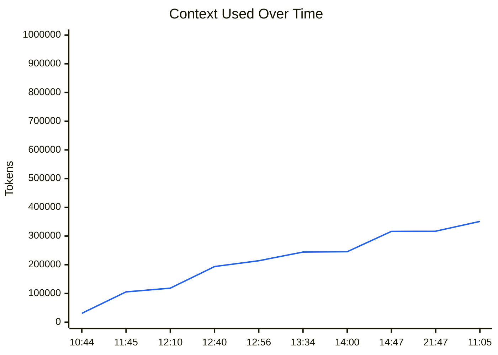
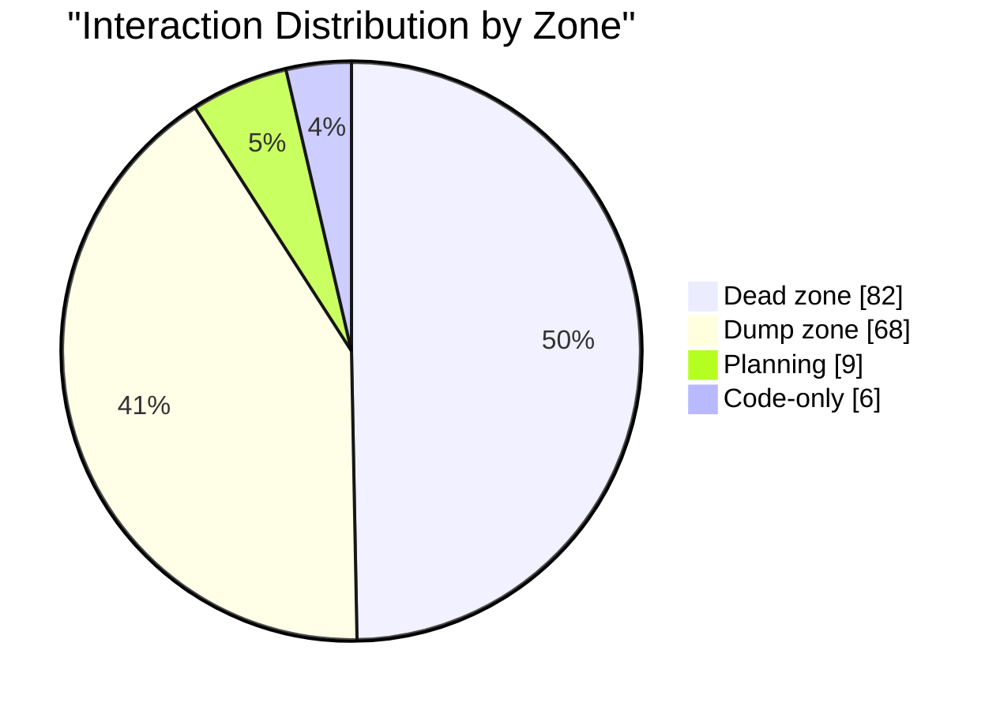
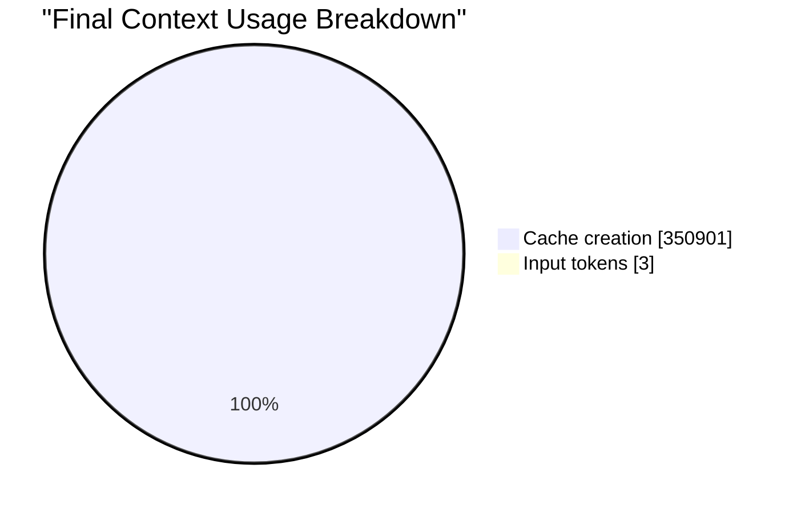
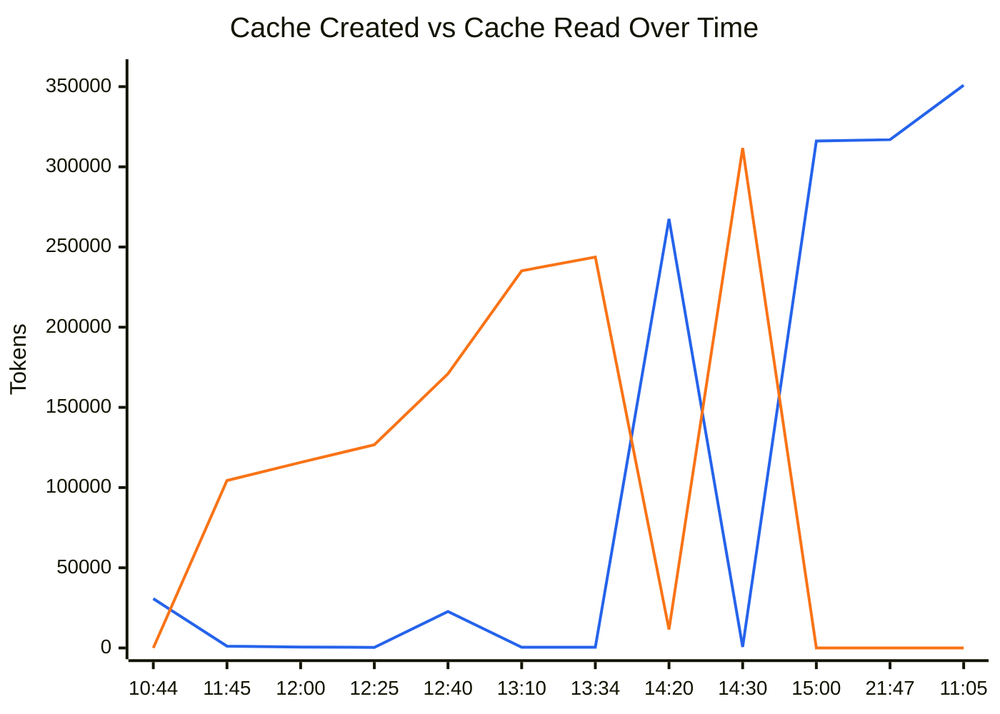

# Context Stats Report

## Generate

```bash
context-stats export 6e551372-2428-4ed6-9346-ec3b605952ff --output report.md
```

## Executive Snapshot

| Signal | Value | Why it matters |
|--------|-------|----------------|
| **Session** | `6e551372-2428-4ed6-9346-ec3b605952ff` | Lets you link this export back to the source interaction stream. |
| **Project** | **m-agent** | Identifies where the report came from. |
| **Model** | **claude-opus-4-6[1m]** | Shows which model produced the session. |
| **Duration** | **24h 20m 23s** | Helps you relate context growth to session length. |
| **Report span** | **2026-04-01 10:44:55 -> 2026-04-02 11:05:18** | Gives the exact time range covered by the export. |
| **Interactions** | **165** | Shows how active the session was overall. |
| **Produced by** | **cc-context-stats v1.15.0** | Shows which tool generated the report. |
| **Generated** | **2026-04-02 11:17:43** | Records when the report was produced. |
| **Final usage** | **350,904** (35.1%) | Shows how close the session ended to the context limit. |
| **Final zone** | **Dead zone** | Indicates whether the session stayed in a safe working range. |
| **Cache activity** | **350,901** (100.0%) | Explains how much of the final context is cache-related. |

## Summary

| Metric | Value |
|--------|-------|
| Context window | 1,000,000 tokens |
| Final usage | 350,904 (35.1%) |
| Total input tokens | 3 |
| Total output tokens | 160 |
| Session cost | $2.1971 |
| Final MI score | 0.848 (Dead zone) |

### Context Usage

**Context usage:** `███████░░░░░░░░░░░░░` 35.1%

## Key Takeaways

- **Final state:** 350,904 used (35.1%) and currently in the **Dead zone**.
- **Growth:** context increased by 320,178 tokens over 24h 20m 23s (32.0% of the window).
- **Largest jump:** 30,726 tokens at interaction #1.
- **Dominant zone:** **Dead zone** for 82 of 165 interactions.
- **Cache load:** 350,901 tokens in cache activity (100.0% of the final used context).
- **Cache pattern:** more cache creation than cache reads, so the session leaned toward new cache material.

## Visual Summary

### Context Trend

Shows how much context was used at each sampled point so you can spot growth, resets, and sudden jumps.



### Zone Distribution

Shows where the session spent most of its time relative to the context window, which highlights whether the conversation stayed in a safe range or drifted into heavier usage.



### Final Context Composition

Shows what made up the last request in the session, which helps explain whether the final context was mostly fresh input, cache reuse, or newly created cache.



### Cache Activity Trend

Shows how cache creation and cache reads evolved over time so you can see when the session started reusing previous work versus building new cache.



- Legend: blue line = `Cache creation`, orange line = `Cache read`.

## Interaction Timeline

| # | Time | Input (req) | Output (req) | Context Used | Usage % | MI | Zone |
|---|------|-------------|--------------|--------------|---------|------|------|
| 1 | 10:44:55 | 3 | 2 | 30,726 | 3.1% | 0.998 | Plan |
| 2 | 10:46:32 | 39 | 97 | 30,990 | 3.1% | 0.998 | Plan |
| 3 | 10:46:36 | 3 | 110 | 31,118 | 3.1% | 0.998 | Plan |
| 4 | 10:46:39 | 1 | 1 | 31,246 | 3.1% | 0.998 | Plan |
| 5 | 10:48:04 | 3 | 173 | 37,251 | 3.7% | 0.997 | Plan |
| 6 | 10:55:24 | 3 | 23 | 38,321 | 3.8% | 0.997 | Plan |
| 7 | 10:56:08 | 3 | 32 | 48,007 | 4.8% | 0.996 | Plan |
| 8 | 10:56:23 | 3 | 36 | 59,235 | 5.9% | 0.994 | Plan |
| 9 | 10:57:26 | 3 | 34 | 60,163 | 6.0% | 0.994 | Plan |
| 10 | 10:57:30 | 3 | 32 | 70,273 | 7.0% | 0.992 | Code |
| 11 | 10:59:26 | 3 | 27 | 78,180 | 7.8% | 0.990 | Code |
| 12 | 10:59:39 | 3 | 1 | 90,444 | 9.0% | 0.987 | Code |
| 13 | 10:59:46 | 1 | 132 | 90,897 | 9.1% | 0.987 | Code |
| 14 | 10:59:50 | 1 | 1 | 91,047 | 9.1% | 0.987 | Code |
| 15 | 11:01:57 | 1 | 1 | 97,528 | 9.8% | 0.985 | Code |
| 16 | 11:03:55 | 1 | 1 | 102,950 | 10.3% | 0.983 | Dump |
| 17 | 11:04:04 | 1 | 88 | 103,571 | 10.4% | 0.983 | Dump |
| 18 | 11:04:14 | 1 | 272 | 103,722 | 10.4% | 0.983 | Dump |
| 19 | 11:04:17 | 1 | 78 | 104,272 | 10.4% | 0.983 | Dump |
| 20 | 11:04:40 | 1 | 1,077 | 104,387 | 10.4% | 0.983 | Dump |
| 21 | 11:45:52 | 3 | 2 | 105,522 | 10.6% | 0.983 | Dump |
| 22 | 11:45:59 | 1 | 121 | 107,032 | 10.7% | 0.982 | Dump |
| 23 | 11:46:03 | 1 | 1 | 109,228 | 10.9% | 0.981 | Dump |
| 24 | 11:48:14 | 1 | 243 | 115,282 | 11.5% | 0.980 | Dump |
| 25 | 11:48:17 | 1 | 78 | 115,592 | 11.6% | 0.979 | Dump |
| 26 | 11:48:28 | 1 | 369 | 115,712 | 11.6% | 0.979 | Dump |
| 27 | 12:00:14 | 3 | 1,947 | 116,231 | 11.6% | 0.979 | Dump |
| 28 | 12:10:03 | 3 | 712 | 118,347 | 11.8% | 0.979 | Dump |
| 29 | 12:14:24 | 3 | 1 | 119,138 | 11.9% | 0.978 | Dump |
| 30 | 12:16:42 | 1 | 235 | 126,348 | 12.6% | 0.976 | Dump |
| 31 | 12:16:52 | 1 | 268 | 126,678 | 12.7% | 0.976 | Dump |
| 32 | 12:25:50 | 3 | 106 | 127,040 | 12.7% | 0.976 | Dump |
| 33 | 12:25:53 | 1 | 87 | 127,533 | 12.8% | 0.975 | Dump |
| 34 | 12:25:58 | 1 | 4 | 134,721 | 13.5% | 0.973 | Dump |
| 35 | 12:26:39 | 1 | 233 | 134,974 | 13.5% | 0.973 | Dump |
| 36 | 12:26:43 | 1 | 2 | 135,225 | 13.5% | 0.973 | Dump |
| 37 | 12:26:53 | 1 | 65 | 136,245 | 13.6% | 0.972 | Dump |
| 38 | 12:27:09 | 1 | 1 | 138,287 | 13.8% | 0.972 | Dump |
| 39 | 12:29:49 | 1 | 3,171 | 142,735 | 14.3% | 0.970 | Dump |
| 40 | 12:30:05 | 1 | 93 | 145,958 | 14.6% | 0.969 | Dump |
| 41 | 12:30:13 | 1 | 1 | 146,478 | 14.6% | 0.968 | Dump |
| 42 | 12:30:31 | 1 | 311 | 146,615 | 14.7% | 0.968 | Dump |
| 43 | 12:30:41 | 1 | 382 | 147,264 | 14.7% | 0.968 | Dump |
| 44 | 12:32:49 | 3 | 158 | 147,738 | 14.8% | 0.968 | Dump |
| 45 | 12:32:54 | 1 | 1 | 156,486 | 15.6% | 0.965 | Dump |
| 46 | 12:33:53 | 2 | 2 | 164,306 | 16.4% | 0.961 | Dump |
| 47 | 12:34:01 | 1 | 130 | 170,141 | 17.0% | 0.959 | Dump |
| 48 | 12:34:09 | 1 | 106 | 170,637 | 17.1% | 0.959 | Dump |
| 49 | 12:34:24 | 1 | 1 | 170,977 | 17.1% | 0.958 | Dump |
| 50 | 12:40:50 | 1 | 146 | 193,720 | 19.4% | 0.948 | Dump |
| 51 | 12:40:55 | 1 | 1 | 193,928 | 19.4% | 0.948 | Dump |
| 52 | 12:41:31 | 1 | 112 | 194,340 | 19.4% | 0.948 | Dump |
| 53 | 12:41:34 | 1 | 1 | 195,422 | 19.5% | 0.947 | Dump |
| 54 | 12:44:34 | 1 | 2 | 202,007 | 20.2% | 0.944 | Dump |
| 55 | 12:44:40 | 1 | 1 | 202,914 | 20.3% | 0.943 | Dump |
| 56 | 12:44:45 | 1 | 1 | 203,257 | 20.3% | 0.943 | Dump |
| 57 | 12:44:59 | 1 | 1 | 204,586 | 20.5% | 0.943 | Dump |
| 58 | 12:45:06 | 1 | 7 | 205,062 | 20.5% | 0.942 | Dump |
| 59 | 12:45:16 | 1 | 6 | 205,721 | 20.6% | 0.942 | Dump |
| 60 | 12:45:24 | 1 | 1 | 206,224 | 20.6% | 0.942 | Dump |
| 61 | 12:45:53 | 1 | 205 | 206,425 | 20.6% | 0.942 | Dump |
| 62 | 12:45:59 | 1 | 1 | 206,714 | 20.7% | 0.941 | Dump |
| 63 | 12:46:08 | 3 | 1 | 210,130 | 21.0% | 0.940 | Dump |
| 64 | 12:47:14 | 1 | 706 | 210,595 | 21.1% | 0.939 | Dump |
| 65 | 12:48:15 | 3 | 177 | 211,352 | 21.1% | 0.939 | Dump |
| 66 | 12:48:22 | 1 | 110 | 211,613 | 21.2% | 0.939 | Dump |
| 67 | 12:48:29 | 1 | 85 | 211,842 | 21.2% | 0.939 | Dump |
| 68 | 12:55:45 | 3 | 2,016 | 211,978 | 21.2% | 0.939 | Dump |
| 69 | 12:56:13 | 3 | 124 | 214,023 | 21.4% | 0.938 | Dump |
| 70 | 12:56:19 | 1 | 1 | 215,043 | 21.5% | 0.937 | Dump |
| 71 | 13:01:40 | 3 | 1 | 235,166 | 23.5% | 0.926 | Dump |
| 72 | 13:10:41 | 1 | 1 | 235,604 | 23.6% | 0.926 | Dump |
| 73 | 13:11:24 | 1 | 2 | 238,886 | 23.9% | 0.924 | Dump |
| 74 | 13:11:56 | 1 | 2 | 241,645 | 24.2% | 0.922 | Dump |
| 75 | 13:12:04 | 1 | 193 | 241,916 | 24.2% | 0.922 | Dump |
| 76 | 13:12:13 | 1 | 1 | 242,380 | 24.2% | 0.922 | Dump |
| 77 | 13:12:42 | 1 | 59 | 242,663 | 24.3% | 0.922 | Dump |
| 78 | 13:12:49 | 1 | 1 | 243,764 | 24.4% | 0.921 | Dump |
| 79 | 13:34:13 | 1 | 369 | 244,203 | 24.4% | 0.921 | Dump |
| 80 | 13:34:37 | 1 | 493 | 244,767 | 24.5% | 0.921 | Dump |
| 81 | 14:00:16 | 3 | 2 | 245,380 | 24.5% | 0.920 | Dump |
| 82 | 14:00:24 | 1 | 143 | 245,557 | 24.6% | 0.920 | Dump |
| 83 | 14:00:52 | 1 | 6 | 249,141 | 24.9% | 0.918 | Dump |
| 84 | 14:08:01 | 1 | 115 | 275,064 | 27.5% | 0.902 | Dead |
| 85 | 14:08:07 | 1 | 137 | 275,239 | 27.5% | 0.902 | Dead |
| 86 | 14:08:20 | 1 | 1 | 275,489 | 27.5% | 0.902 | Dead |
| 87 | 14:08:37 | 1 | 59 | 275,743 | 27.6% | 0.902 | Dead |
| 88 | 14:08:44 | 1 | 1 | 277,595 | 27.8% | 0.900 | Dead |
| 89 | 14:09:16 | 1 | 765 | 278,206 | 27.8% | 0.900 | Dead |
| 90 | 14:20:44 | 3 | 2 | 279,127 | 27.9% | 0.899 | Dead |
| 91 | 14:20:51 | 3 | 141 | 279,738 | 28.0% | 0.899 | Dead |
| 92 | 14:20:56 | 1 | 1 | 281,901 | 28.2% | 0.898 | Dead |
| 93 | 14:21:18 | 1 | 2 | 283,015 | 28.3% | 0.897 | Dead |
| 94 | 14:21:31 | 1 | 568 | 283,748 | 28.4% | 0.896 | Dead |
| 95 | 14:21:36 | 1 | 2 | 284,369 | 28.4% | 0.896 | Dead |
| 96 | 14:21:43 | 1 | 272 | 284,979 | 28.5% | 0.896 | Dead |
| 97 | 14:21:46 | 1 | 1 | 285,304 | 28.5% | 0.895 | Dead |
| 98 | 14:21:56 | 1 | 275 | 285,600 | 28.6% | 0.895 | Dead |
| 99 | 14:22:12 | 1 | 226 | 285,981 | 28.6% | 0.895 | Dead |
| 100 | 14:22:25 | 1 | 352 | 286,331 | 28.6% | 0.895 | Dead |
| 101 | 14:23:53 | 3 | 112 | 286,771 | 28.7% | 0.894 | Dead |
| 102 | 14:23:57 | 1 | 69 | 287,017 | 28.7% | 0.894 | Dead |
| 103 | 14:24:01 | 1 | 1 | 289,803 | 29.0% | 0.892 | Dead |
| 104 | 14:24:14 | 1 | 63 | 290,143 | 29.0% | 0.892 | Dead |
| 105 | 14:24:23 | 1 | 1 | 290,955 | 29.1% | 0.892 | Dead |
| 106 | 14:24:35 | 1 | 3 | 292,465 | 29.2% | 0.891 | Dead |
| 107 | 14:24:40 | 1 | 86 | 292,788 | 29.3% | 0.890 | Dead |
| 108 | 14:24:52 | 1 | 1 | 293,304 | 29.3% | 0.890 | Dead |
| 109 | 14:24:59 | 1 | 1 | 295,078 | 29.5% | 0.889 | Dead |
| 110 | 14:25:06 | 1 | 2 | 296,818 | 29.7% | 0.888 | Dead |
| 111 | 14:25:24 | 1 | 2 | 298,196 | 29.8% | 0.887 | Dead |
| 112 | 14:25:29 | 1 | 4 | 299,254 | 29.9% | 0.886 | Dead |
| 113 | 14:25:36 | 1 | 4 | 300,933 | 30.1% | 0.885 | Dead |
| 114 | 14:25:49 | 1 | 1 | 302,005 | 30.2% | 0.884 | Dead |
| 115 | 14:25:58 | 1 | 5 | 303,516 | 30.4% | 0.883 | Dead |
| 116 | 14:27:53 | 1 | 137 | 309,820 | 31.0% | 0.879 | Dead |
| 117 | 14:29:19 | 3 | 27 | 310,698 | 31.1% | 0.878 | Dead |
| 118 | 14:29:42 | 3 | 39 | 311,693 | 31.2% | 0.877 | Dead |
| 119 | 14:30:52 | 3 | 32 | 312,342 | 31.2% | 0.877 | Dead |
| 120 | 14:32:09 | 3 | 1 | 313,022 | 31.3% | 0.876 | Dead |
| 121 | 14:32:19 | 1 | 140 | 315,916 | 31.6% | 0.874 | Dead |
| 122 | 14:32:27 | 1 | 1 | 316,175 | 31.6% | 0.874 | Dead |
| 123 | 14:47:48 | 1 | 53 | 316,429 | 31.6% | 0.874 | Dead |
| 124 | 14:47:55 | 1 | 1 | 318,604 | 31.9% | 0.872 | Dead |
| 125 | 14:52:45 | 1 | 632 | 319,059 | 31.9% | 0.872 | Dead |
| 126 | 15:00:40 | 3 | 2 | 316,062 | 31.6% | 0.874 | Dead |
| 127 | 21:47:08 | 3 | 122 | 316,914 | 31.7% | 0.874 | Dead |
| 128 | 21:47:21 | 1 | 397 | 317,990 | 31.8% | 0.873 | Dead |
| 129 | 21:47:29 | 1 | 1 | 318,433 | 31.8% | 0.873 | Dead |
| 130 | 21:47:37 | 1 | 137 | 318,650 | 31.9% | 0.872 | Dead |
| 131 | 21:47:46 | 1 | 153 | 320,005 | 32.0% | 0.871 | Dead |
| 132 | 21:47:53 | 1 | 105 | 320,699 | 32.1% | 0.871 | Dead |
| 133 | 21:48:01 | 1 | 281 | 321,766 | 32.2% | 0.870 | Dead |
| 134 | 21:48:09 | 1 | 1 | 326,896 | 32.7% | 0.866 | Dead |
| 135 | 21:48:17 | 1 | 162 | 327,191 | 32.7% | 0.866 | Dead |
| 136 | 21:48:27 | 1 | 224 | 327,415 | 32.7% | 0.866 | Dead |
| 137 | 21:48:32 | 1 | 162 | 327,701 | 32.8% | 0.866 | Dead |
| 138 | 21:48:42 | 1 | 275 | 327,925 | 32.8% | 0.866 | Dead |
| 139 | 21:48:49 | 1 | 164 | 328,262 | 32.8% | 0.865 | Dead |
| 140 | 21:48:56 | 1 | 91 | 328,746 | 32.9% | 0.865 | Dead |
| 141 | 21:49:03 | 1 | 212 | 328,952 | 32.9% | 0.865 | Dead |
| 142 | 21:49:09 | 1 | 118 | 329,226 | 32.9% | 0.865 | Dead |
| 143 | 21:49:16 | 1 | 165 | 329,655 | 33.0% | 0.864 | Dead |
| 144 | 21:49:24 | 1 | 231 | 329,882 | 33.0% | 0.864 | Dead |
| 145 | 21:49:32 | 1 | 170 | 330,175 | 33.0% | 0.864 | Dead |
| 146 | 21:49:40 | 1 | 239 | 330,407 | 33.0% | 0.864 | Dead |
| 147 | 21:49:46 | 1 | 166 | 330,708 | 33.1% | 0.864 | Dead |
| 148 | 21:49:54 | 1 | 231 | 331,047 | 33.1% | 0.863 | Dead |
| 149 | 21:50:00 | 1 | 161 | 331,340 | 33.1% | 0.863 | Dead |
| 150 | 21:50:07 | 1 | 223 | 331,563 | 33.2% | 0.863 | Dead |
| 151 | 21:50:13 | 1 | 1 | 331,848 | 33.2% | 0.863 | Dead |
| 152 | 21:51:53 | 1 | 181 | 332,087 | 33.2% | 0.863 | Dead |
| 153 | 21:52:03 | 1 | 165 | 332,436 | 33.2% | 0.862 | Dead |
| 154 | 21:52:10 | 1 | 1 | 333,536 | 33.4% | 0.861 | Dead |
| 155 | 21:53:12 | 1 | 275 | 334,018 | 33.4% | 0.861 | Dead |
| 156 | 21:55:00 | 3 | 1 | 338,930 | 33.9% | 0.857 | Dead |
| 157 | 21:56:15 | 1 | 186 | 344,013 | 34.4% | 0.854 | Dead |
| 158 | 21:59:46 | 3 | 21 | 344,952 | 34.5% | 0.853 | Dead |
| 159 | 22:01:39 | 3 | 20 | 346,298 | 34.6% | 0.852 | Dead |
| 160 | 22:01:50 | 3 | 20 | 347,650 | 34.8% | 0.851 | Dead |
| 161 | 22:01:57 | 3 | 30 | 348,286 | 34.8% | 0.850 | Dead |
| 162 | 22:02:50 | 3 | 133 | 349,617 | 35.0% | 0.849 | Dead |
| 163 | 22:03:02 | 1 | 310 | 350,088 | 35.0% | 0.849 | Dead |
| 164 | 22:03:15 | 1 | 327 | 350,666 | 35.1% | 0.848 | Dead |
| 165 | 11:05:18 | 3 | 160 | 350,904 | 35.1% | 0.848 | Dead |

## Context Growth

- **Starting context:** 30,726 tokens
- **Final context:** 350,904 tokens
- **Total growth:** 320,178 tokens
- **Largest single jump:** 30,726 tokens (interaction #1)

## Cache Statistics

| # | Time | Cache Create | Cache Read |
|---|------|--------------|------------|
| 1 | 10:44:55 | 30,723 | 0 |
| 2 | 10:46:32 | 228 | 30,723 |
| 3 | 10:46:36 | 164 | 30,951 |
| 4 | 10:46:39 | 294 | 30,951 |
| 5 | 10:48:04 | 6,003 | 31,245 |
| 6 | 10:55:24 | 38,318 | 0 |
| 7 | 10:56:08 | 9,686 | 38,318 |
| 8 | 10:56:23 | 11,228 | 48,004 |
| 9 | 10:57:26 | 928 | 59,232 |
| 10 | 10:57:30 | 11,038 | 59,232 |
| 11 | 10:59:26 | 7,907 | 70,270 |
| 12 | 10:59:39 | 12,264 | 78,177 |
| 13 | 10:59:46 | 455 | 90,441 |
| 14 | 10:59:50 | 150 | 90,896 |
| 15 | 11:01:57 | 6,481 | 91,046 |
| 16 | 11:03:55 | 5,422 | 97,527 |
| 17 | 11:04:04 | 621 | 102,949 |
| 18 | 11:04:14 | 151 | 103,570 |
| 19 | 11:04:17 | 550 | 103,721 |
| 20 | 11:04:40 | 115 | 104,271 |
| 21 | 11:45:52 | 1,133 | 104,386 |
| 22 | 11:45:59 | 1,512 | 105,519 |
| 23 | 11:46:03 | 2,196 | 107,031 |
| 24 | 11:48:14 | 6,054 | 109,227 |
| 25 | 11:48:17 | 310 | 115,281 |
| 26 | 11:48:28 | 120 | 115,591 |
| 27 | 12:00:14 | 517 | 115,711 |
| 28 | 12:10:03 | 2,116 | 116,228 |
| 29 | 12:14:24 | 791 | 118,344 |
| 30 | 12:16:42 | 7,212 | 119,135 |
| 31 | 12:16:52 | 330 | 126,347 |
| 32 | 12:25:50 | 360 | 126,677 |
| 33 | 12:25:53 | 855 | 126,677 |
| 34 | 12:25:58 | 7,188 | 127,532 |
| 35 | 12:26:39 | 253 | 134,720 |
| 36 | 12:26:43 | 251 | 134,973 |
| 37 | 12:26:53 | 1,020 | 135,224 |
| 38 | 12:27:09 | 2,042 | 136,244 |
| 39 | 12:29:49 | 4,448 | 138,286 |
| 40 | 12:30:05 | 3,223 | 142,734 |
| 41 | 12:30:13 | 520 | 145,957 |
| 42 | 12:30:31 | 137 | 146,477 |
| 43 | 12:30:41 | 649 | 146,614 |
| 44 | 12:32:49 | 472 | 147,263 |
| 45 | 12:32:54 | 8,750 | 147,735 |
| 46 | 12:33:53 | 7,819 | 156,485 |
| 47 | 12:34:01 | 5,836 | 164,304 |
| 48 | 12:34:09 | 496 | 170,140 |
| 49 | 12:34:24 | 340 | 170,636 |
| 50 | 12:40:50 | 22,743 | 170,976 |
| 51 | 12:40:55 | 208 | 193,719 |
| 52 | 12:41:31 | 412 | 193,927 |
| 53 | 12:41:34 | 1,494 | 193,927 |
| 54 | 12:44:34 | 6,585 | 195,421 |
| 55 | 12:44:40 | 907 | 202,006 |
| 56 | 12:44:45 | 343 | 202,913 |
| 57 | 12:44:59 | 1,329 | 203,256 |
| 58 | 12:45:06 | 476 | 204,585 |
| 59 | 12:45:16 | 659 | 205,061 |
| 60 | 12:45:24 | 503 | 205,720 |
| 61 | 12:45:53 | 201 | 206,223 |
| 62 | 12:45:59 | 289 | 206,424 |
| 63 | 12:46:08 | 3,414 | 206,713 |
| 64 | 12:47:14 | 467 | 210,127 |
| 65 | 12:48:15 | 199,799 | 11,550 |
| 66 | 12:48:22 | 263 | 211,349 |
| 67 | 12:48:29 | 229 | 211,612 |
| 68 | 12:55:45 | 134 | 211,841 |
| 69 | 12:56:13 | 2,045 | 211,975 |
| 70 | 12:56:19 | 1,022 | 214,020 |
| 71 | 13:01:40 | 20,121 | 215,042 |
| 72 | 13:10:41 | 440 | 235,163 |
| 73 | 13:11:24 | 3,282 | 235,603 |
| 74 | 13:11:56 | 2,759 | 238,885 |
| 75 | 13:12:04 | 271 | 241,644 |
| 76 | 13:12:13 | 464 | 241,915 |
| 77 | 13:12:42 | 283 | 242,379 |
| 78 | 13:12:49 | 1,101 | 242,662 |
| 79 | 13:34:13 | 439 | 243,763 |
| 80 | 13:34:37 | 564 | 244,202 |
| 81 | 14:00:16 | 233,827 | 11,550 |
| 82 | 14:00:24 | 179 | 245,377 |
| 83 | 14:00:52 | 3,584 | 245,556 |
| 84 | 14:08:01 | 25,923 | 249,140 |
| 85 | 14:08:07 | 175 | 275,063 |
| 86 | 14:08:20 | 250 | 275,238 |
| 87 | 14:08:37 | 254 | 275,488 |
| 88 | 14:08:44 | 1,852 | 275,742 |
| 89 | 14:09:16 | 611 | 277,594 |
| 90 | 14:20:44 | 267,574 | 11,550 |
| 91 | 14:20:51 | 611 | 279,124 |
| 92 | 14:20:56 | 2,165 | 279,735 |
| 93 | 14:21:18 | 1,114 | 281,900 |
| 94 | 14:21:31 | 733 | 283,014 |
| 95 | 14:21:36 | 621 | 283,747 |
| 96 | 14:21:43 | 610 | 284,368 |
| 97 | 14:21:46 | 325 | 284,978 |
| 98 | 14:21:56 | 296 | 285,303 |
| 99 | 14:22:12 | 381 | 285,599 |
| 100 | 14:22:25 | 350 | 285,980 |
| 101 | 14:23:53 | 438 | 286,330 |
| 102 | 14:23:57 | 248 | 286,768 |
| 103 | 14:24:01 | 2,786 | 287,016 |
| 104 | 14:24:14 | 340 | 289,802 |
| 105 | 14:24:23 | 812 | 290,142 |
| 106 | 14:24:35 | 1,510 | 290,954 |
| 107 | 14:24:40 | 323 | 292,464 |
| 108 | 14:24:52 | 516 | 292,787 |
| 109 | 14:24:59 | 1,774 | 293,303 |
| 110 | 14:25:06 | 1,740 | 295,077 |
| 111 | 14:25:24 | 1,378 | 296,817 |
| 112 | 14:25:29 | 1,058 | 298,195 |
| 113 | 14:25:36 | 1,679 | 299,253 |
| 114 | 14:25:49 | 1,072 | 300,932 |
| 115 | 14:25:58 | 1,511 | 302,004 |
| 116 | 14:27:53 | 6,304 | 303,515 |
| 117 | 14:29:19 | 876 | 309,819 |
| 118 | 14:29:42 | 995 | 310,695 |
| 119 | 14:30:52 | 649 | 311,690 |
| 120 | 14:32:09 | 680 | 312,339 |
| 121 | 14:32:19 | 2,896 | 313,019 |
| 122 | 14:32:27 | 259 | 315,915 |
| 123 | 14:47:48 | 254 | 316,174 |
| 124 | 14:47:55 | 2,175 | 316,428 |
| 125 | 14:52:45 | 455 | 318,603 |
| 126 | 15:00:40 | 316,059 | 0 |
| 127 | 21:47:08 | 316,911 | 0 |
| 128 | 21:47:21 | 1,078 | 316,911 |
| 129 | 21:47:29 | 443 | 317,989 |
| 130 | 21:47:37 | 217 | 318,432 |
| 131 | 21:47:46 | 1,355 | 318,649 |
| 132 | 21:47:53 | 694 | 320,004 |
| 133 | 21:48:01 | 1,067 | 320,698 |
| 134 | 21:48:09 | 5,130 | 321,765 |
| 135 | 21:48:17 | 295 | 326,895 |
| 136 | 21:48:27 | 224 | 327,190 |
| 137 | 21:48:32 | 286 | 327,414 |
| 138 | 21:48:42 | 224 | 327,700 |
| 139 | 21:48:49 | 337 | 327,924 |
| 140 | 21:48:56 | 484 | 328,261 |
| 141 | 21:49:03 | 206 | 328,745 |
| 142 | 21:49:09 | 274 | 328,951 |
| 143 | 21:49:16 | 429 | 329,225 |
| 144 | 21:49:24 | 227 | 329,654 |
| 145 | 21:49:32 | 293 | 329,881 |
| 146 | 21:49:40 | 232 | 330,174 |
| 147 | 21:49:46 | 301 | 330,406 |
| 148 | 21:49:54 | 339 | 330,707 |
| 149 | 21:50:00 | 293 | 331,046 |
| 150 | 21:50:07 | 223 | 331,339 |
| 151 | 21:50:13 | 285 | 331,562 |
| 152 | 21:51:53 | 239 | 331,847 |
| 153 | 21:52:03 | 349 | 332,086 |
| 154 | 21:52:10 | 1,100 | 332,435 |
| 155 | 21:53:12 | 482 | 333,535 |
| 156 | 21:55:00 | 338,927 | 0 |
| 157 | 21:56:15 | 5,085 | 338,927 |
| 158 | 21:59:46 | 10,932 | 334,017 |
| 159 | 22:01:39 | 1,346 | 344,949 |
| 160 | 22:01:50 | 1,352 | 346,295 |
| 161 | 22:01:57 | 636 | 347,647 |
| 162 | 22:02:50 | 1,331 | 348,283 |
| 163 | 22:03:02 | 473 | 349,614 |
| 164 | 22:03:15 | 578 | 350,087 |
| 165 | 11:05:18 | 350,901 | 0 |

---
*Generated by [cc-context-stats](https://github.com/luongnv89/cc-context-stats) v1.15.0*
