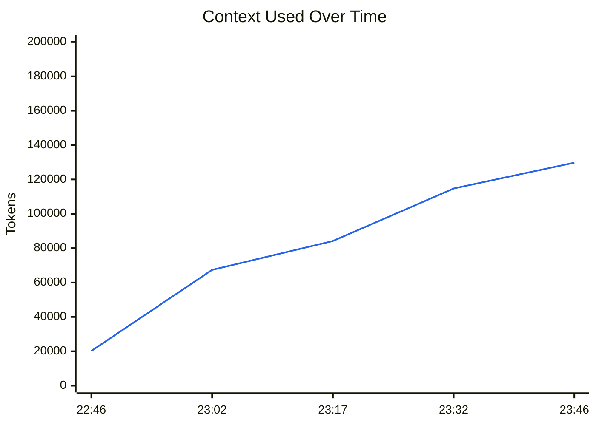
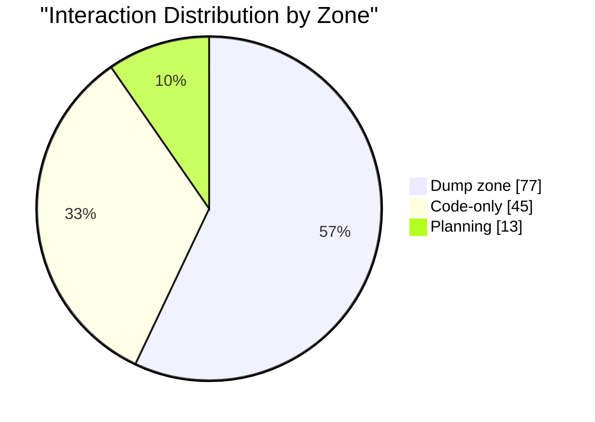
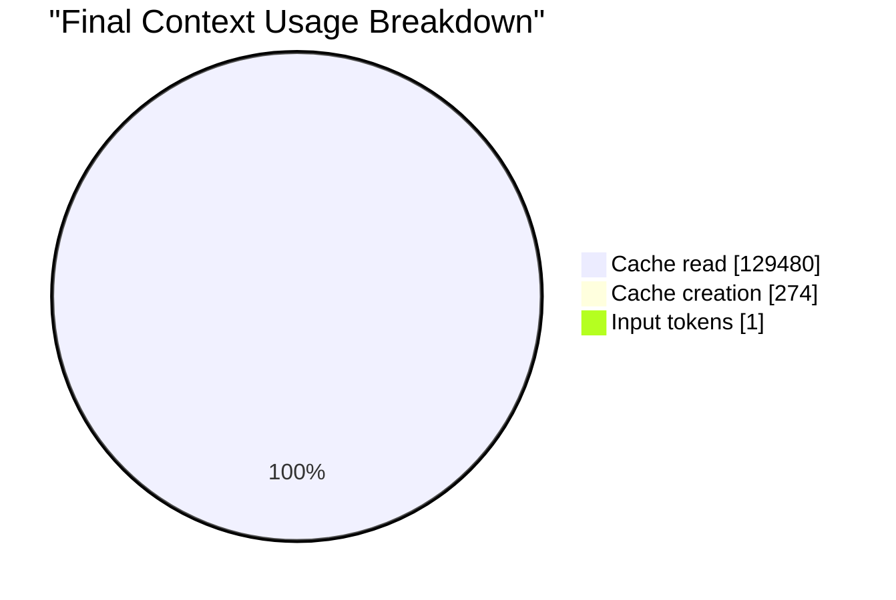
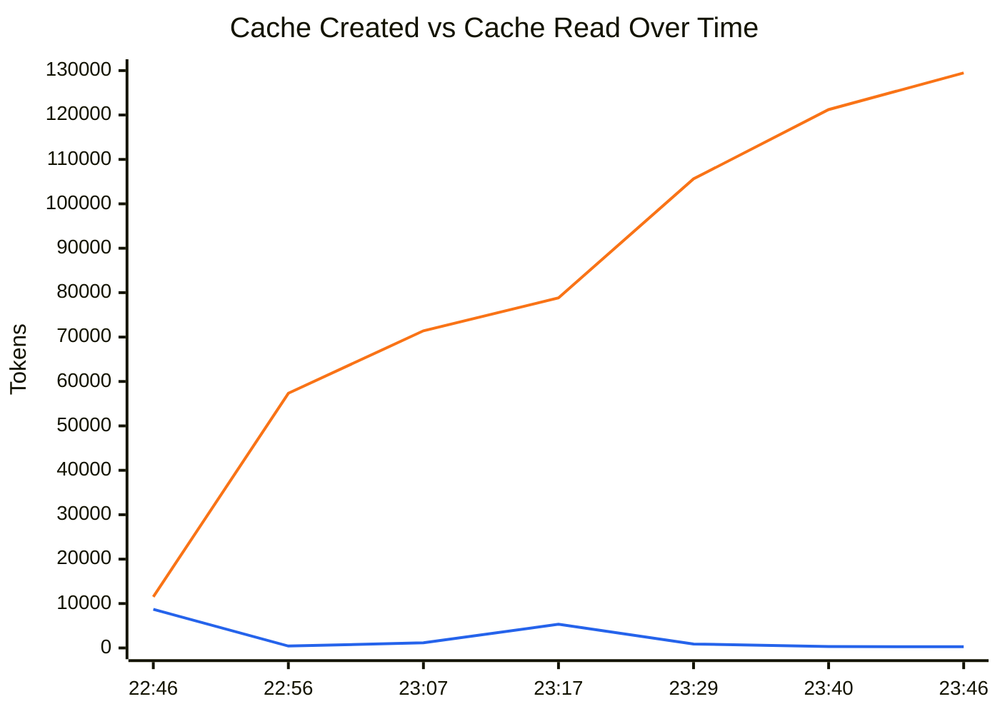

# Context Stats Report

**Report span:** 2026-04-01 22:46:38 -> 2026-04-01 23:46:10
**Produced by:** cc-context-stats v1.15.0

## Generate

```bash
context-stats 8bb55603-45b8-4bdf-aa04-d51366610b1a export --output report.md
```

## Executive Snapshot

| Signal             | Value                                  | Why it matters                                                   |
| ------------------ | -------------------------------------- | ---------------------------------------------------------------- |
| **Session**        | `8bb55603-45b8-4bdf-aa04-d51366610b1a` | Lets you link this export back to the source interaction stream. |
| **Project**        | **claude-howto**                       | Identifies where the report came from.                           |
| **Model**          | **claude-sonnet-4-6**                  | Shows which model produced the session.                          |
| **Duration**       | **59m 32s**                            | Helps you relate context growth to session length.               |
| **Interactions**   | **135**                                | Shows how active the session was overall.                        |
| **Generated**      | **2026-04-01 23:47:05**                | Records when the report was produced.                            |
| **Final usage**    | **129,755** (64.9%)                    | Shows how close the session ended to the context limit.          |
| **Final zone**     | **Dump zone**                          | Indicates whether the session stayed in a safe working range.    |
| **Cache activity** | **129,754** (100.0%)                   | Explains how much of the final context is cache-related.         |

## Summary

| Metric              | Value             |
| ------------------- | ----------------- |
| Context window      | 200,000 tokens    |
| Final usage         | 129,755 (64.9%)   |
| Total input tokens  | 491               |
| Total output tokens | 31,342            |
| Session cost        | $4.4135           |
| Lines changed       | +513 / -403       |
| Final MI score      | 0.477 (Dump zone) |

### Context Usage

**Context usage:** `████████████░░░░░░░░` 64.9%

## Key Takeaways

- **Final state:** 129,755 used (64.9%) and currently in the **Dump zone**.
- **Growth:** context increased by 109,549 tokens over 59m 32s (54.8% of the window).
- **Largest jump:** 20,206 tokens at interaction #1.
- **Dominant zone:** **Dump zone** for 77 of 135 interactions.
- **Cache load:** 129,754 tokens in cache activity (100.0% of the final used context).
- **Cache pattern:** cache reads outweighed creation, so the session reused prior work heavily.

## Visual Summary

### Context Trend

Shows how much context was used at each sampled point so you can spot growth, resets, and sudden jumps.



### Zone Distribution

Shows where the session spent most of its time relative to the context window, which highlights whether the conversation stayed in a safe range or drifted into heavier usage.



### Final Context Composition

Shows what made up the last request in the session, which helps explain whether the final context was mostly fresh input, cache reuse, or newly created cache.



### Cache Activity Trend

Shows how cache creation and cache reads evolved over time so you can see when the session started reusing previous work versus building new cache.



- Legend: blue line = `Cache creation`, orange line = `Cache read`.

## Interaction Timeline

| #   | Time     | Input (req) | Output (req) | Context Used | Usage % | MI    | Zone |
| --- | -------- | ----------- | ------------ | ------------ | ------- | ----- | ---- |
| 1   | 22:46:38 | 2           | 109          | 20,206       | 10.1%   | 0.968 | Plan |
| 2   | 22:46:46 | 1           | 115          | 22,191       | 11.1%   | 0.963 | Plan |
| 3   | 22:46:52 | 1           | 142          | 24,246       | 12.1%   | 0.958 | Plan |
| 4   | 22:46:59 | 1           | 147          | 34,762       | 17.4%   | 0.928 | Plan |
| 5   | 22:47:13 | 1           | 533          | 35,369       | 17.7%   | 0.926 | Plan |
| 6   | 22:51:51 | 3           | 438          | 36,072       | 18.0%   | 0.923 | Plan |
| 7   | 22:51:59 | 1           | 24           | 36,553       | 18.3%   | 0.922 | Plan |
| 8   | 22:52:25 | 3           | 79           | 43,418       | 21.7%   | 0.899 | Plan |
| 9   | 22:52:35 | 1           | 227          | 43,995       | 22.0%   | 0.897 | Plan |
| 10  | 22:52:42 | 1           | 16           | 44,285       | 22.1%   | 0.896 | Plan |
| 11  | 22:53:52 | 3           | 71           | 44,325       | 22.2%   | 0.896 | Plan |
| 12  | 22:53:57 | 1           | 143          | 44,564       | 22.3%   | 0.895 | Plan |
| 13  | 22:54:02 | 1           | 1            | 49,969       | 25.0%   | 0.875 | Plan |
| 14  | 22:54:11 | 1           | 163          | 50,425       | 25.2%   | 0.873 | Code |
| 15  | 22:54:18 | 1           | 237          | 50,654       | 25.3%   | 0.873 | Code |
| 16  | 22:54:21 | 1           | 1            | 50,938       | 25.5%   | 0.871 | Code |
| 17  | 22:54:28 | 1           | 52           | 51,347       | 25.7%   | 0.870 | Code |
| 18  | 22:55:24 | 3           | 128          | 51,442       | 25.7%   | 0.870 | Code |
| 19  | 22:55:30 | 1           | 94           | 51,663       | 25.8%   | 0.869 | Code |
| 20  | 22:55:36 | 1           | 121          | 52,122       | 26.1%   | 0.867 | Code |
| 21  | 22:55:42 | 1           | 79           | 54,504       | 27.3%   | 0.858 | Code |
| 22  | 22:55:51 | 1           | 1            | 55,296       | 27.6%   | 0.855 | Code |
| 23  | 22:56:04 | 1           | 2            | 55,657       | 27.8%   | 0.853 | Code |
| 24  | 22:56:12 | 1           | 79           | 56,427       | 28.2%   | 0.850 | Code |
| 25  | 22:56:18 | 1           | 85           | 56,548       | 28.3%   | 0.850 | Code |
| 26  | 22:56:21 | 1           | 91           | 56,665       | 28.3%   | 0.849 | Code |
| 27  | 22:56:26 | 1           | 118          | 57,194       | 28.6%   | 0.847 | Code |
| 28  | 22:56:31 | 1           | 117          | 57,344       | 28.7%   | 0.846 | Code |
| 29  | 22:56:40 | 1           | 197          | 57,778       | 28.9%   | 0.845 | Code |
| 30  | 22:56:46 | 1           | 79           | 57,995       | 29.0%   | 0.844 | Code |
| 31  | 22:56:50 | 1           | 94           | 59,078       | 29.5%   | 0.839 | Code |
| 32  | 22:57:01 | 1           | 105          | 59,982       | 30.0%   | 0.836 | Code |
| 33  | 22:58:20 | 3           | 199          | 60,229       | 30.1%   | 0.835 | Code |
| 34  | 23:00:28 | 3           | 169          | 60,490       | 30.2%   | 0.834 | Code |
| 35  | 23:00:35 | 1           | 2            | 64,518       | 32.3%   | 0.817 | Code |
| 36  | 23:00:40 | 1           | 100          | 65,076       | 32.5%   | 0.814 | Code |
| 37  | 23:00:45 | 1           | 1            | 65,194       | 32.6%   | 0.814 | Code |
| 38  | 23:01:09 | 1           | 200          | 67,166       | 33.6%   | 0.805 | Code |
| 39  | 23:02:13 | 3           | 96           | 67,394       | 33.7%   | 0.804 | Code |
| 40  | 23:05:32 | 1           | 105          | 67,532       | 33.8%   | 0.804 | Code |
| 41  | 23:05:39 | 1           | 158          | 67,778       | 33.9%   | 0.803 | Code |
| 42  | 23:05:47 | 1           | 1            | 68,080       | 34.0%   | 0.801 | Code |
| 43  | 23:06:05 | 1           | 605          | 68,939       | 34.5%   | 0.798 | Code |
| 44  | 23:06:19 | 1           | 811          | 69,590       | 34.8%   | 0.795 | Code |
| 45  | 23:06:24 | 1           | 1            | 70,445       | 35.2%   | 0.791 | Code |
| 46  | 23:06:39 | 1           | 1            | 71,415       | 35.7%   | 0.787 | Code |
| 47  | 23:07:00 | 1           | 1            | 72,571       | 36.3%   | 0.781 | Code |
| 48  | 23:07:45 | 3           | 77           | 72,831       | 36.4%   | 0.780 | Code |
| 49  | 23:07:54 | 1           | 1            | 76,221       | 38.1%   | 0.765 | Code |
| 50  | 23:08:07 | 1           | 1            | 76,844       | 38.4%   | 0.762 | Code |
| 51  | 23:08:15 | 1           | 86           | 77,155       | 38.6%   | 0.760 | Code |
| 52  | 23:16:03 | 3           | 79           | 77,254       | 38.6%   | 0.760 | Code |
| 53  | 23:16:09 | 1           | 58           | 77,677       | 38.8%   | 0.758 | Code |
| 54  | 23:16:16 | 1           | 1            | 77,868       | 38.9%   | 0.757 | Code |
| 55  | 23:16:23 | 1           | 111          | 78,255       | 39.1%   | 0.755 | Code |
| 56  | 23:16:32 | 1           | 141          | 78,409       | 39.2%   | 0.755 | Code |
| 57  | 23:16:40 | 1           | 67           | 78,725       | 39.4%   | 0.753 | Code |
| 58  | 23:16:48 | 1           | 237          | 78,825       | 39.4%   | 0.753 | Code |
| 59  | 23:17:46 | 1           | 1            | 84,172       | 42.1%   | 0.727 | Dump |
| 60  | 23:17:50 | 1           | 79           | 84,450       | 42.2%   | 0.726 | Dump |
| 61  | 23:17:56 | 1           | 1            | 85,611       | 42.8%   | 0.720 | Dump |
| 62  | 23:18:03 | 1           | 103          | 86,053       | 43.0%   | 0.718 | Dump |
| 63  | 23:18:06 | 1           | 81           | 86,309       | 43.2%   | 0.717 | Dump |
| 64  | 23:18:12 | 1           | 421          | 86,934       | 43.5%   | 0.713 | Dump |
| 65  | 23:18:16 | 1           | 100          | 87,421       | 43.7%   | 0.711 | Dump |
| 66  | 23:18:19 | 1           | 79           | 87,563       | 43.8%   | 0.710 | Dump |
| 67  | 23:18:26 | 1           | 418          | 88,386       | 44.2%   | 0.706 | Dump |
| 68  | 23:18:31 | 1           | 330          | 88,849       | 44.4%   | 0.704 | Dump |
| 69  | 23:18:37 | 1           | 197          | 89,224       | 44.6%   | 0.702 | Dump |
| 70  | 23:18:43 | 1           | 126          | 89,466       | 44.7%   | 0.701 | Dump |
| 71  | 23:18:47 | 1           | 128          | 89,749       | 44.9%   | 0.699 | Dump |
| 72  | 23:18:53 | 1           | 2            | 89,920       | 45.0%   | 0.699 | Dump |
| 73  | 23:18:59 | 1           | 1            | 90,196       | 45.1%   | 0.697 | Dump |
| 74  | 23:19:10 | 1           | 283          | 90,668       | 45.3%   | 0.695 | Dump |
| 75  | 23:19:14 | 1           | 2            | 90,996       | 45.5%   | 0.693 | Dump |
| 76  | 23:21:25 | 1           | 118          | 91,631       | 45.8%   | 0.690 | Dump |
| 77  | 23:21:34 | 1           | 1            | 93,777       | 46.9%   | 0.679 | Dump |
| 78  | 23:21:45 | 1           | 1            | 94,483       | 47.2%   | 0.675 | Dump |
| 79  | 23:21:51 | 1           | 1            | 94,797       | 47.4%   | 0.674 | Dump |
| 80  | 23:21:56 | 1           | 2            | 95,079       | 47.5%   | 0.672 | Dump |
| 81  | 23:24:19 | 1           | 188          | 98,833       | 49.4%   | 0.653 | Dump |
| 82  | 23:24:23 | 1           | 81           | 99,063       | 49.5%   | 0.651 | Dump |
| 83  | 23:24:28 | 1           | 1            | 99,814       | 49.9%   | 0.647 | Dump |
| 84  | 23:24:36 | 1           | 79           | 100,767      | 50.4%   | 0.642 | Dump |
| 85  | 23:24:41 | 1           | 1            | 102,089      | 51.0%   | 0.635 | Dump |
| 86  | 23:24:49 | 1           | 201          | 102,359      | 51.2%   | 0.634 | Dump |
| 87  | 23:24:55 | 1           | 168          | 102,605      | 51.3%   | 0.633 | Dump |
| 88  | 23:24:59 | 1           | 146          | 102,824      | 51.4%   | 0.631 | Dump |
| 89  | 23:25:05 | 1           | 201          | 103,017      | 51.5%   | 0.630 | Dump |
| 90  | 23:25:13 | 1           | 262          | 103,265      | 51.6%   | 0.629 | Dump |
| 91  | 23:25:17 | 1           | 1            | 103,685      | 51.8%   | 0.627 | Dump |
| 92  | 23:27:10 | 1           | 1            | 104,907      | 52.5%   | 0.620 | Dump |
| 93  | 23:27:20 | 1           | 205          | 105,370      | 52.7%   | 0.618 | Dump |
| 94  | 23:27:24 | 1           | 1            | 105,622      | 52.8%   | 0.616 | Dump |
| 95  | 23:29:07 | 1           | 58           | 106,513      | 53.3%   | 0.611 | Dump |
| 96  | 23:29:15 | 1           | 163          | 106,644      | 53.3%   | 0.611 | Dump |
| 97  | 23:29:27 | 1           | 1            | 111,672      | 55.8%   | 0.583 | Dump |
| 98  | 23:29:35 | 1           | 198          | 112,083      | 56.0%   | 0.580 | Dump |
| 99  | 23:29:41 | 1           | 378          | 112,326      | 56.2%   | 0.579 | Dump |
| 100 | 23:29:47 | 1           | 1            | 112,749      | 56.4%   | 0.577 | Dump |
| 101 | 23:29:54 | 1           | 247          | 113,125      | 56.6%   | 0.575 | Dump |
| 102 | 23:30:02 | 1           | 308          | 113,417      | 56.7%   | 0.573 | Dump |
| 103 | 23:31:46 | 1           | 58           | 114,155      | 57.1%   | 0.569 | Dump |
| 104 | 23:31:51 | 1           | 1            | 114,396      | 57.2%   | 0.567 | Dump |
| 105 | 23:32:49 | 1           | 197          | 114,716      | 57.4%   | 0.566 | Dump |
| 106 | 23:34:34 | 1           | 174          | 115,001      | 57.5%   | 0.564 | Dump |
| 107 | 23:34:45 | 1           | 90           | 115,314      | 57.7%   | 0.562 | Dump |
| 108 | 23:34:56 | 1           | 154          | 120,209      | 60.1%   | 0.534 | Dump |
| 109 | 23:36:21 | 1           | 1            | 120,390      | 60.2%   | 0.533 | Dump |
| 110 | 23:38:13 | 1           | 58           | 121,090      | 60.5%   | 0.529 | Dump |
| 111 | 23:38:16 | 1           | 1            | 121,221      | 60.6%   | 0.528 | Dump |
| 112 | 23:40:07 | 1           | 129          | 121,536      | 60.8%   | 0.526 | Dump |
| 113 | 23:40:13 | 1           | 93           | 121,683      | 60.8%   | 0.525 | Dump |
| 114 | 23:40:19 | 1           | 94           | 121,808      | 60.9%   | 0.525 | Dump |
| 115 | 23:40:26 | 1           | 99           | 121,926      | 61.0%   | 0.524 | Dump |
| 116 | 23:40:32 | 1           | 98           | 122,054      | 61.0%   | 0.523 | Dump |
| 117 | 23:40:39 | 1           | 129          | 123,491      | 61.7%   | 0.515 | Dump |
| 118 | 23:40:46 | 1           | 158          | 124,076      | 62.0%   | 0.511 | Dump |
| 119 | 23:40:53 | 1           | 4            | 124,339      | 62.2%   | 0.510 | Dump |
| 120 | 23:41:01 | 1           | 2            | 124,743      | 62.4%   | 0.507 | Dump |
| 121 | 23:41:11 | 1           | 89           | 125,088      | 62.5%   | 0.505 | Dump |
| 122 | 23:41:18 | 1           | 2            | 125,426      | 62.7%   | 0.503 | Dump |
| 123 | 23:41:27 | 1           | 1            | 125,943      | 63.0%   | 0.500 | Dump |
| 124 | 23:41:38 | 1           | 215          | 126,313      | 63.2%   | 0.498 | Dump |
| 125 | 23:41:44 | 1           | 97           | 126,572      | 63.3%   | 0.497 | Dump |
| 126 | 23:41:51 | 1           | 237          | 126,942      | 63.5%   | 0.494 | Dump |
| 127 | 23:41:58 | 1           | 138          | 127,223      | 63.6%   | 0.493 | Dump |
| 128 | 23:43:45 | 1           | 94           | 127,509      | 63.8%   | 0.491 | Dump |
| 129 | 23:43:52 | 1           | 202          | 128,014      | 64.0%   | 0.488 | Dump |
| 130 | 23:43:59 | 1           | 138          | 128,260      | 64.1%   | 0.486 | Dump |
| 131 | 23:45:45 | 1           | 102          | 128,546      | 64.3%   | 0.485 | Dump |
| 132 | 23:45:50 | 1           | 119          | 129,017      | 64.5%   | 0.482 | Dump |
| 133 | 23:45:56 | 1           | 121          | 129,265      | 64.6%   | 0.480 | Dump |
| 134 | 23:46:02 | 1           | 1            | 129,481      | 64.7%   | 0.479 | Dump |
| 135 | 23:46:10 | 1           | 200          | 129,755      | 64.9%   | 0.477 | Dump |

## Context Growth

- **Starting context:** 20,206 tokens
- **Final context:** 129,755 tokens
- **Total growth:** 109,549 tokens
- **Largest single jump:** 20,206 tokens (interaction #1)

## Cache Statistics

| #   | Time     | Cache Create | Cache Read |
| --- | -------- | ------------ | ---------- |
| 1   | 22:46:38 | 8,693        | 11,511     |
| 2   | 22:46:46 | 1,986        | 20,204     |
| 3   | 22:46:52 | 2,055        | 22,190     |
| 4   | 22:46:59 | 10,516       | 24,245     |
| 5   | 22:47:13 | 607          | 34,761     |
| 6   | 22:51:51 | 701          | 35,368     |
| 7   | 22:51:59 | 483          | 36,069     |
| 8   | 22:52:25 | 6,863        | 36,552     |
| 9   | 22:52:35 | 579          | 43,415     |
| 10  | 22:52:42 | 290          | 43,994     |
| 11  | 22:53:52 | 38           | 44,284     |
| 12  | 22:53:57 | 241          | 44,322     |
| 13  | 22:54:02 | 5,405        | 44,563     |
| 14  | 22:54:11 | 456          | 49,968     |
| 15  | 22:54:18 | 229          | 50,424     |
| 16  | 22:54:21 | 513          | 50,424     |
| 17  | 22:54:28 | 409          | 50,937     |
| 18  | 22:55:24 | 93           | 51,346     |
| 19  | 22:55:30 | 223          | 51,439     |
| 20  | 22:55:36 | 459          | 51,662     |
| 21  | 22:55:42 | 2,382        | 52,121     |
| 22  | 22:55:51 | 792          | 54,503     |
| 23  | 22:56:04 | 361          | 55,295     |
| 24  | 22:56:12 | 770          | 55,656     |
| 25  | 22:56:18 | 121          | 56,426     |
| 26  | 22:56:21 | 117          | 56,547     |
| 27  | 22:56:26 | 529          | 56,664     |
| 28  | 22:56:31 | 679          | 56,664     |
| 29  | 22:56:40 | 434          | 57,343     |
| 30  | 22:56:46 | 217          | 57,777     |
| 31  | 22:56:50 | 1,083        | 57,994     |
| 32  | 22:57:01 | 904          | 59,077     |
| 33  | 22:58:20 | 245          | 59,981     |
| 34  | 23:00:28 | 261          | 60,226     |
| 35  | 23:00:35 | 4,030        | 60,487     |
| 36  | 23:00:40 | 558          | 64,517     |
| 37  | 23:00:45 | 118          | 65,075     |
| 38  | 23:01:09 | 1,972        | 65,193     |
| 39  | 23:02:13 | 226          | 67,165     |
| 40  | 23:05:32 | 140          | 67,391     |
| 41  | 23:05:39 | 246          | 67,531     |
| 42  | 23:05:47 | 302          | 67,777     |
| 43  | 23:06:05 | 859          | 68,079     |
| 44  | 23:06:19 | 651          | 68,938     |
| 45  | 23:06:24 | 855          | 69,589     |
| 46  | 23:06:39 | 970          | 70,444     |
| 47  | 23:07:00 | 1,156        | 71,414     |
| 48  | 23:07:45 | 258          | 72,570     |
| 49  | 23:07:54 | 3,650        | 72,570     |
| 50  | 23:08:07 | 623          | 76,220     |
| 51  | 23:08:15 | 311          | 76,843     |
| 52  | 23:16:03 | 97           | 77,154     |
| 53  | 23:16:09 | 522          | 77,154     |
| 54  | 23:16:16 | 616          | 77,251     |
| 55  | 23:16:23 | 387          | 77,867     |
| 56  | 23:16:32 | 154          | 78,254     |
| 57  | 23:16:40 | 316          | 78,408     |
| 58  | 23:16:48 | 100          | 78,724     |
| 59  | 23:17:46 | 5,347        | 78,824     |
| 60  | 23:17:50 | 278          | 84,171     |
| 61  | 23:17:56 | 1,161        | 84,449     |
| 62  | 23:18:03 | 442          | 85,610     |
| 63  | 23:18:06 | 256          | 86,052     |
| 64  | 23:18:12 | 625          | 86,308     |
| 65  | 23:18:16 | 487          | 86,933     |
| 66  | 23:18:19 | 142          | 87,420     |
| 67  | 23:18:26 | 965          | 87,420     |
| 68  | 23:18:31 | 463          | 88,385     |
| 69  | 23:18:37 | 375          | 88,848     |
| 70  | 23:18:43 | 242          | 89,223     |
| 71  | 23:18:47 | 283          | 89,465     |
| 72  | 23:18:53 | 171          | 89,748     |
| 73  | 23:18:59 | 276          | 89,919     |
| 74  | 23:19:10 | 472          | 90,195     |
| 75  | 23:19:14 | 328          | 90,667     |
| 76  | 23:21:25 | 635          | 90,995     |
| 77  | 23:21:34 | 2,146        | 91,630     |
| 78  | 23:21:45 | 706          | 93,776     |
| 79  | 23:21:51 | 314          | 94,482     |
| 80  | 23:21:56 | 282          | 94,796     |
| 81  | 23:24:19 | 3,754        | 95,078     |
| 82  | 23:24:23 | 230          | 98,832     |
| 83  | 23:24:28 | 751          | 99,062     |
| 84  | 23:24:36 | 953          | 99,813     |
| 85  | 23:24:41 | 1,322        | 100,766    |
| 86  | 23:24:49 | 270          | 102,088    |
| 87  | 23:24:55 | 246          | 102,358    |
| 88  | 23:24:59 | 219          | 102,604    |
| 89  | 23:25:05 | 193          | 102,823    |
| 90  | 23:25:13 | 248          | 103,016    |
| 91  | 23:25:17 | 420          | 103,264    |
| 92  | 23:27:10 | 1,222        | 103,684    |
| 93  | 23:27:20 | 463          | 104,906    |
| 94  | 23:27:24 | 715          | 104,906    |
| 95  | 23:29:07 | 891          | 105,621    |
| 96  | 23:29:15 | 1,022        | 105,621    |
| 97  | 23:29:27 | 5,028        | 106,643    |
| 98  | 23:29:35 | 411          | 111,671    |
| 99  | 23:29:41 | 243          | 112,082    |
| 100 | 23:29:47 | 423          | 112,325    |
| 101 | 23:29:54 | 376          | 112,748    |
| 102 | 23:30:02 | 292          | 113,124    |
| 103 | 23:31:46 | 738          | 113,416    |
| 104 | 23:31:51 | 241          | 114,154    |
| 105 | 23:32:49 | 320          | 114,395    |
| 106 | 23:34:34 | 285          | 114,715    |
| 107 | 23:34:45 | 313          | 115,000    |
| 108 | 23:34:56 | 4,895        | 115,313    |
| 109 | 23:36:21 | 181          | 120,208    |
| 110 | 23:38:13 | 700          | 120,389    |
| 111 | 23:38:16 | 131          | 121,089    |
| 112 | 23:40:07 | 315          | 121,220    |
| 113 | 23:40:13 | 147          | 121,535    |
| 114 | 23:40:19 | 125          | 121,682    |
| 115 | 23:40:26 | 118          | 121,807    |
| 116 | 23:40:32 | 128          | 121,925    |
| 117 | 23:40:39 | 1,437        | 122,053    |
| 118 | 23:40:46 | 585          | 123,490    |
| 119 | 23:40:53 | 263          | 124,075    |
| 120 | 23:41:01 | 404          | 124,338    |
| 121 | 23:41:11 | 345          | 124,742    |
| 122 | 23:41:18 | 338          | 125,087    |
| 123 | 23:41:27 | 517          | 125,425    |
| 124 | 23:41:38 | 370          | 125,942    |
| 125 | 23:41:44 | 259          | 126,312    |
| 126 | 23:41:51 | 370          | 126,571    |
| 127 | 23:41:58 | 651          | 126,571    |
| 128 | 23:43:45 | 286          | 127,222    |
| 129 | 23:43:52 | 505          | 127,508    |
| 130 | 23:43:59 | 246          | 128,013    |
| 131 | 23:45:45 | 286          | 128,259    |
| 132 | 23:45:50 | 471          | 128,545    |
| 133 | 23:45:56 | 248          | 129,016    |
| 134 | 23:46:02 | 216          | 129,264    |
| 135 | 23:46:10 | 274          | 129,480    |

---

_Generated by [cc-context-stats](https://github.com/luongnv89/cc-context-stats) v1.15.0_
