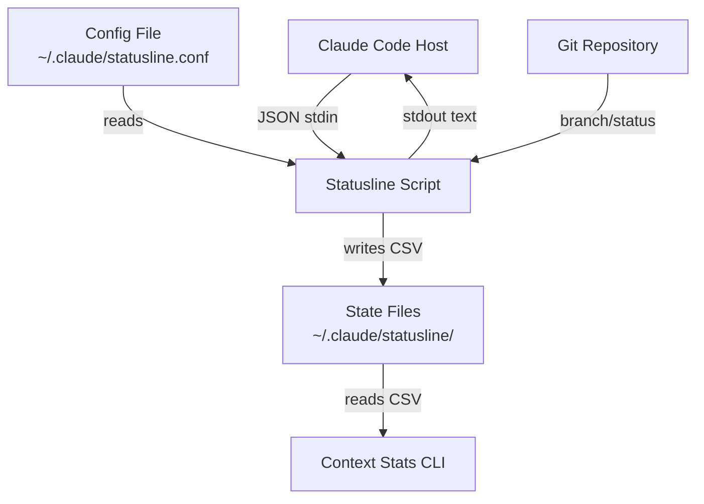

# Architecture

## Overview

context-stats provides real-time context monitoring for Claude Code sessions. It consists of two main components:

1. **Status Line** - A compact one-line display integrated into Claude Code's UI
2. **Context Stats CLI** - A live terminal dashboard with ASCII graphs

## System Architecture



```
┌─────────────┐     JSON stdin      ┌──────────────────┐
│ Claude Code  │ ──────────────────> │ Statusline Script │
│   (host)     │ <────────────────── │     (Python)      │
└─────────────┘     stdout text     └──────┬───────────┘
                                           │ writes
                                           ▼
                                    ┌──────────────────┐
                                    │  State Files      │
                                    │  ~/.claude/       │
                                    │  statusline/      │
                                    └──────┬───────────┘
                                           │ reads
                                           ▼
                                    ┌──────────────────┐
                                    │ Context Stats CLI │
                                    │    (Python)       │
                                    └──────────────────┘
```

## Component Details

### Status Line Script

| Script          | Language | Dependencies | State Writes |
| --------------- | -------- | ------------ | ------------ |
| `statusline.py` | Python 3 | None         | Yes          |

**Data flow:**

1. Claude Code pipes JSON state via stdin on each refresh
2. Script parses model info, context tokens, session data
3. Script reads `~/.claude/statusline.conf` for user preferences
4. Script checks git status for branch/changes info (5-second timeout)
5. Script writes state to `~/.claude/statusline/<session_id>.state`
6. Script outputs formatted ANSI text to stdout

### Context Stats CLI

| Script             | Language | Install Method              |
| ------------------ | -------- | --------------------------- |
| `context_stats.py` | Python   | `pip install context-stats` |

The Python CLI provides live ASCII graphs with zone awareness. Install via `pip install context-stats` to get the `context-stats` command.

### Python Package (`src/claude_statusline/`)

The pip-installable package provides both the statusline and context-stats CLI:

```
src/claude_statusline/
├── __init__.py              # Package version and exports
├── __main__.py              # python -m claude_statusline entry
├── cli/
│   ├── statusline.py        # claude-statusline entry point
│   └── context_stats.py     # context-stats entry point
├── core/
│   ├── colors.py            # ANSI color management
│   ├── config.py            # Configuration loading
│   ├── git.py               # Git status detection (5s timeout)
│   └── state.py             # State file reading/writing/rotation
├── formatters/
│   ├── layout.py            # Output width/layout management
│   ├── time.py              # Duration formatting
│   └── tokens.py            # Token count formatting
├── graphs/
│   ├── renderer.py          # ASCII graph rendering
│   └── statistics.py        # Data statistics
└── ui/
    ├── icons.py             # Unicode icons
    └── waiting.py           # Waiting animation
```

### State Files

State files persist token history between statusline refreshes:

```
~/.claude/statusline/statusline.<session_id>.state
```

Each line is a CSV record with 15 comma-separated fields (timestamp, token counts, cost, session metadata, context metrics, and cumulative API duration). See [CSV_FORMAT.md](CSV_FORMAT.md) for the full field specification. The context-stats CLI reads these files to render graphs.

**Rotation:** Files are automatically rotated at 10,000 lines, keeping the most recent 5,000 entries. This prevents unbounded file growth during long sessions.

**Session ID validation:** IDs are validated to reject path-traversal characters (`/`, `\`, `..`, null bytes).

## Data Privacy

All data stays local:

- State files are written to `~/.claude/statusline/`
- No network requests are made
- No telemetry or analytics

## Configuration

User preferences are stored in `~/.claude/statusline.conf` as simple `key=value` pairs. See [Configuration](configuration.md) for details.
