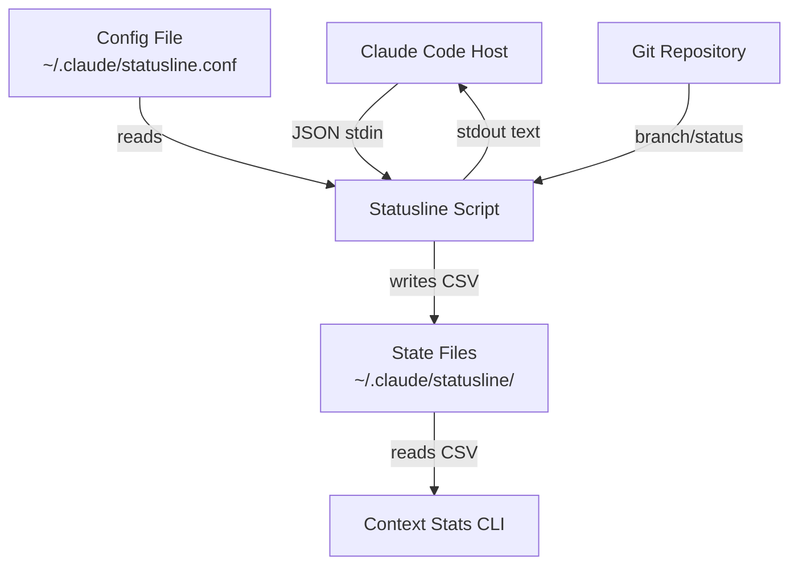

# Architecture

## Overview

context-stats provides real-time context monitoring for Claude Code sessions. It consists of two main components:

1. **Status Line** - A compact one-line display integrated into Claude Code's UI
2. **Context Stats CLI** - A live terminal dashboard with ASCII graphs

## System Architecture


```mermaid
graph TD
    CC[Claude Code Host] -->|JSON stdin| SL[Statusline Script]
    SL -->|stdout text| CC
    SL -->|writes CSV| SF[State Files<br/>~/.claude/statusline/]
    SF -->|reads CSV| CS[Context Stats CLI]
    CF[Config File<br/>~/.claude/statusline.conf] -->|reads| SL
    GIT[Git Repository] -->|branch/status| SL
```

```
┌─────────────┐     JSON stdin      ┌──────────────────┐
│ Claude Code  │ ──────────────────> │ Statusline Script │
│   (host)     │ <────────────────── │     (Python)      │
└─────────────┘     stdout text     └──────┬───────────┘
                                           │ writes
                                           ▼
                                    ┌──────────────────┐
                                    │  State Files      │
                                    │  ~/.claude/       │
                                    │  statusline/      │
                                    └──────┬───────────┘
                                           │ reads
                                           ▼
                                    ┌──────────────────┐
                                    │ Context Stats CLI │
                                    │    (Python)       │
                                    └──────────────────┘
```

## Component Details

### Status Line Script

| Script          | Language | Dependencies | State Writes |
| --------------- | -------- | ------------ | ------------ |
| `statusline.py` | Python 3 | None         | Yes          |

**Data flow:**

1. Claude Code pipes JSON state via stdin on each refresh
2. Script parses model info, context tokens, session data
3. Script reads `~/.claude/statusline.conf` for user preferences
4. Script checks git status for branch/changes info (5-second timeout)
5. Script writes state to `~/.claude/statusline/<session_id>.state`
6. Script outputs formatted ANSI text to stdout

### Context Stats CLI

| Script             | Language | Install Method              |
| ------------------ | -------- | --------------------------- |
| `context_stats.py` | Python   | `pip install context-stats` |

The Python CLI provides live ASCII graphs with zone awareness. Install via `pip install context-stats` to get the `context-stats` command.

### Python Package (`src/claude_statusline/`)

The pip-installable package provides both the statusline and context-stats CLI:

```
src/claude_statusline/
├── __init__.py                    # Package version and exports
├── __main__.py                    # python -m claude_statusline entry
├── _shared.py                     # Pure helpers single-sourced with the standalone script
├── analytics.py                   # Aggregations shared by report/export commands
├── cli/
│   ├── __init__.py
│   ├── statusline.py              # claude-statusline entry point
│   ├── context_stats.py           # context-stats dashboard entry point
│   ├── cache_warm.py              # context-stats cache-warm subcommand
│   ├── explain.py                 # context-stats explain subcommand
│   ├── export.py                  # context-stats export subcommand
│   └── report.py                  # context-stats report subcommand
├── core/
│   ├── __init__.py
│   ├── colors.py                  # ANSI color management
│   ├── config.py                  # Configuration loading
│   ├── git.py                     # Git status detection + PR lookup (5s timeout)
│   └── state.py                   # State file reading/writing/rotation
├── data/
│   ├── __init__.py
│   └── statusline.conf.default    # Default config template written on first run
├── formatters/
│   ├── __init__.py
│   ├── layout.py                  # Output width/layout management (reflow)
│   ├── time.py                    # Duration formatting
│   └── tokens.py                  # Token count formatting
├── graphs/
│   ├── __init__.py
│   ├── intelligence.py            # MI score, zones, pacman icon
│   ├── renderer.py                # ASCII graph rendering
│   └── statistics.py              # Data statistics and tok/s computation
└── ui/
    ├── __init__.py
    ├── icons.py                   # Unicode icons
    └── waiting.py                 # Waiting animation
```

### State Files

State files persist token history between statusline refreshes:

```
~/.claude/statusline/statusline.<session_id>.state
```

Each line is a CSV record with 15 comma-separated fields (timestamp, token counts, cost, session metadata, context metrics, and cumulative API duration). See [CSV_FORMAT.md](CSV_FORMAT.md) for the full field specification. The context-stats CLI reads these files to render graphs.

**Rotation:** Files are automatically rotated at 10,000 lines, keeping the most recent 5,000 entries. This prevents unbounded file growth during long sessions.

**Session ID validation:** IDs are validated to reject path-traversal characters (`/`, `\`, `..`, null bytes).

**Permissions:** Newly created state files get owner-only `0600` permissions — rows carry session ids and costs.

## Data Privacy

All data stays local:

- State files are written to `~/.claude/statusline/`
- No network requests are made
- No telemetry or analytics

### Local trust boundary

The statusline's only external input is the JSON document Claude Code pipes to
stdin. Everything downstream is treated as untrusted at the boundary:

- `workspace.project_dir` is **resolved and verified to be an existing
  directory** before any `git`/`gh` subprocess runs with it as the working
  directory (F-SEC-002); otherwise git/PR lookups are skipped entirely.
- `session_id` is **validated against path-traversal characters** before it is
  ever interpolated into a state-file path (F-BUG-002).
- Explicit JSON nulls are normalized to "absent" for every extracted field, so
  a payload shape change degrades gracefully instead of crashing the render.
- Any unexpected render exception emits a minimal fallback line on stdout and
  diagnostics on stderr only.

## Configuration

User preferences are stored in `~/.claude/statusline.conf` as simple `key=value` pairs. See [Configuration](configuration.md) for details.
