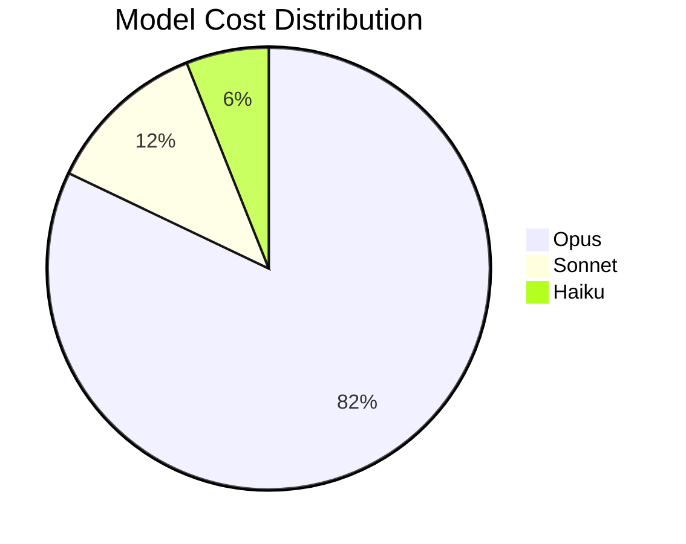
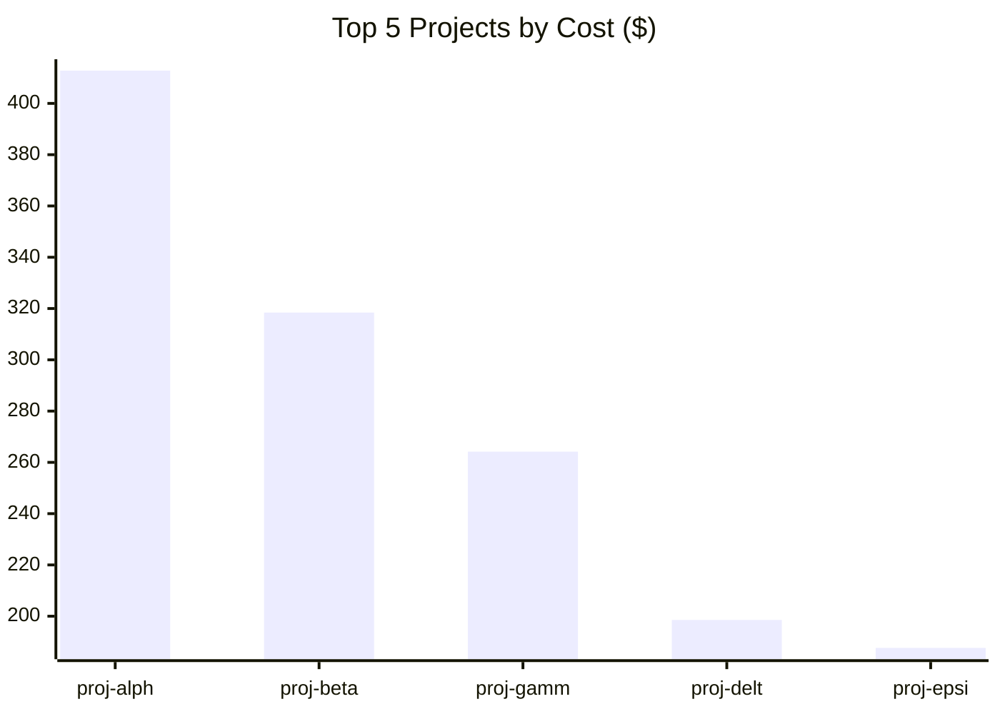
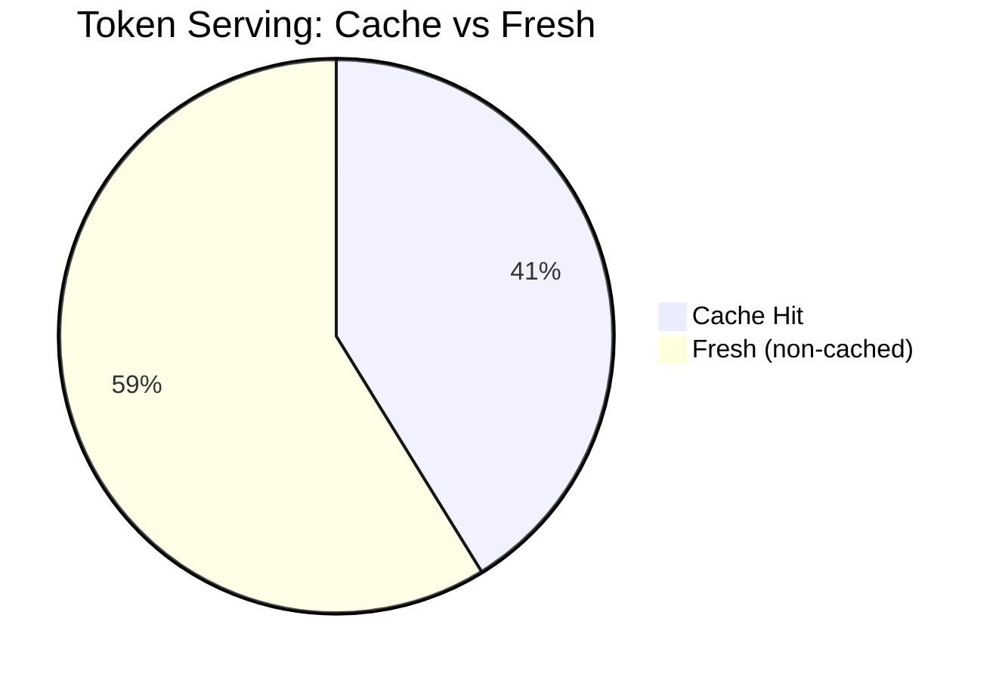
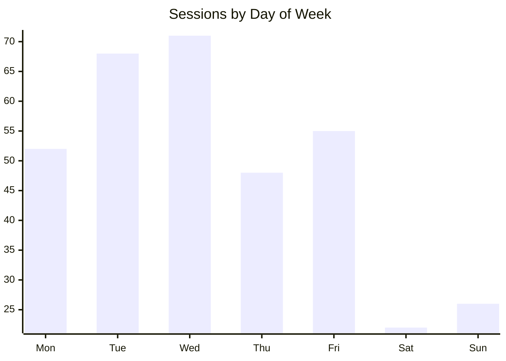
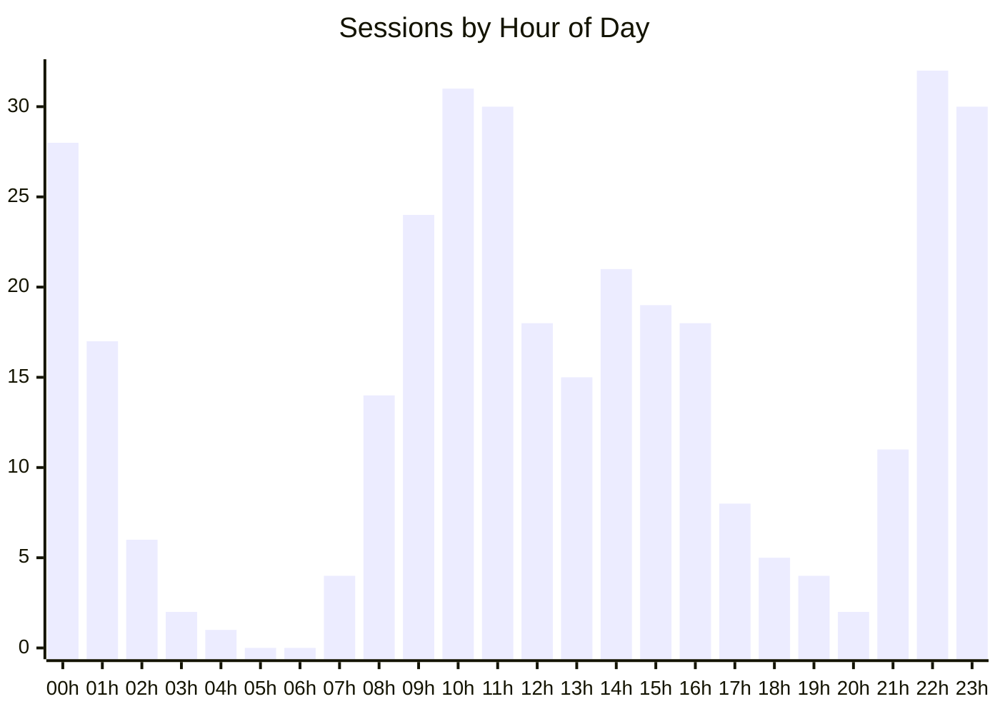
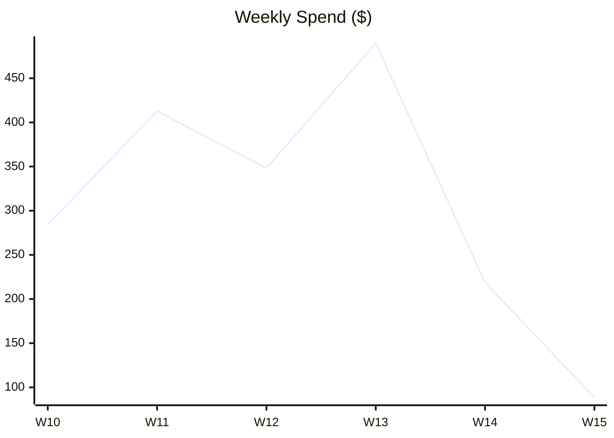
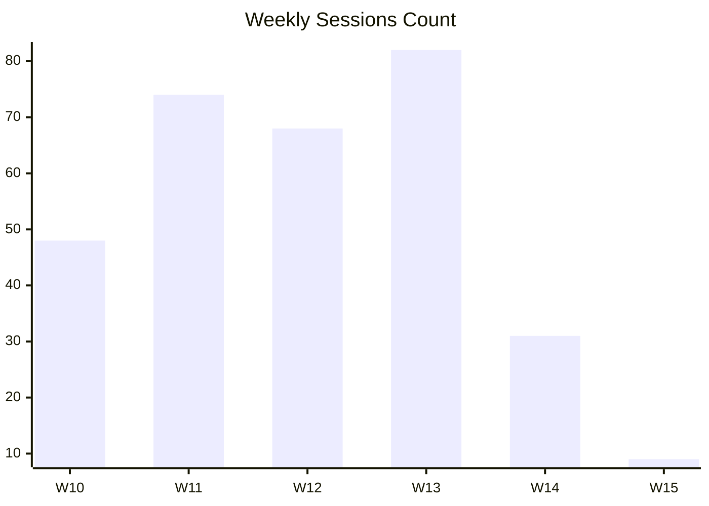

# Token Usage Analytics Report

Generated: 2026-04-07 12:00:00
Source: cc-context-stats v1.18.0

> **Note:** This is a sample report for the last 30 days (2026-03-08 → 2026-04-07).
> All project names and session IDs have been anonymized.
> Generated with: `context-stats report --since-days 30`

## Executive Summary

| Metric | Value |
|--------|-------|
| Total Spend | $1,842.35 |
| Total Sessions | 312 |
| Projects Analyzed | 18 |
| Cache Hit Ratio | 41.2% |
| Avg Session Cost | $5.90 |
| Avg Session Duration | 3h 22m 14s |
| Most Expensive Session | a3f9c12d... ($87.40, 4.7% of total) |
| Most Expensive Project | project-alpha ($412.80, 22.4% of total) |

## Model Usage Breakdown

| Model Family | Sessions | Total Tokens | Cost | % of Total Cost |
|---|---|---|---|---|
| opus | 241 | 38,204,512 | $1512.30 | 82.1% |
| sonnet | 42 | 5,918,340 | $218.75 | 11.9% |
| haiku | 29 | 5,102,876 | $111.30 | 6.0% |

## Cost Optimization Analysis

### Key Findings

- **Real Sessions**: 312 sessions costing $1,842.35
- **Cache Hit Ratio**: 41.2% (room for improvement if <70%)
- **Cost per 1k tokens**: $0.037

### Top Cost Drivers (Top 10 Sessions)
| Session | Project | Cost | Cache % | Duration | Input | Output |
|---------|---------|------|---------|----------|-------|--------|
| a3f9c12d... | project-alpha | $87.40 | 5% | 2h 14m 03s | 812,340 | 793,218 |
| b7e2d45a... | project-alpha | $74.15 | 8% | 45m 21s | 698,120 | 684,492 |
| c1d8f903... | project-beta | $68.92 | 12% | 1h 08m 55s | 640,880 | 631,107 |
| d4a6e721... | project-gamma | $61.38 | 3% | 3h 42m 17s | 6,210 | 448,920 |
| e9b3c584... | project-alpha | $58.77 | 6% | 33m 49s | 541,650 | 536,212 |
| f2c7a819... | project-delta | $54.03 | 19% | 58m 12s | 497,440 | 488,350 |
| g5e1b347... | project-beta | $51.66 | 7% | 1h 52m 40s | 472,810 | 468,993 |
| h8f4d092... | project-alpha | $48.24 | 4% | 22m 07s | 448,730 | 444,120 |
| i6a2c715... | project-epsilon | $44.91 | 14% | 4h 05m 28s | 412,200 | 408,730 |
| j3b9e468... | project-gamma | $39.58 | 11% | 1h 17m 36s | 368,490 | 361,204 |

### Optimization Opportunities

2. **Sessions with low cache efficiency** (avg 0%)
   - These sessions could benefit most from optimized prompts:

     - k7d4f831... (project-zeta): 0% cache hit
     - l2c8e109... (project-eta): 0% cache hit
     - m5b1a674... (Unknown): 0% cache hit

3. **Model efficiency by family**
   | Model | Sessions | $/1k tokens |
   |-------|----------|-------------|
   | haiku | 29 | $0.022 |
   | opus | 241 | $0.040 |
   | sonnet | 42 | $0.037 |

4. **High-spend projects to review**
   | Project | Sessions | Cost | Cache Hit % |
   |---------|----------|------|-------------|
   | project-alpha | 28 | $412.80 | 12% |
   | project-beta | 41 | $318.44 | 44% |
   | project-gamma | 35 | $264.17 | 38% |
   | project-delta | 27 | $198.53 | 49% |
   | project-epsilon | 22 | $187.62 | 31% |

## Cost Efficiency

- **Overall cache efficiency**: 41.2% of tokens served from cache
- **Average tokens per dollar**: 26,973 tokens/$

### Top 5 Most Efficient Sessions (lowest $/1k tokens)
|  Session | Project | $/1k tokens | Cost | Tokens |
|---|---|---|---|---|
| n4c7b215... | project-zeta | $0.000 | $0.00 | 42,180 |
| o9e3a841... | project-eta | $0.000 | $0.00 | 38,490 |
| p2f8d607... | Unknown | $0.000 | $0.00 | 96,340 |
| q6a1c394... | project-theta | $0.010 | $0.18 | 18,200 |
| r3b5e720... | project-iota | $0.012 | $0.31 | 25,680 |

### Top 5 Least Efficient Sessions (highest $/1k tokens)
| Session | Project | $/1k tokens | Cost | Tokens |
|---|---|---|---|---|
| s8d2f415... | project-beta | $0.138 | $21.42 | 155,240 |
| t5c9a803... | project-alpha | $0.134 | $18.77 | 140,070 |
| u1e6b247... | project-kappa | $0.131 | $16.38 | 125,000 |
| v4f3c981... | project-delta | $0.129 | $14.93 | 115,750 |
| w7a8e526... | project-gamma | $0.127 | $52.14 | 410,550 |

## Daily Activity Heatmap

### Sessions by Day of Week
| Day | Count | Activity |
|-----|-------|----------|
| Mon | 52 | ############........ |
| Tue | 68 | ##################.. |
| Wed | 71 | #################### |
| Thu | 48 | #############....... |
| Fri | 55 | ###############..... |
| Sat | 22 | ######.............. |
| Sun | 26 | #######............. |

### Sessions by Hour of Day
| Hour | Count | Activity |
|------|-------|----------|
| 00 | 28 | #################### |
| 01 | 17 | ############........ |
| 02 | 6 | ####................ |
| 03 | 2 | #................... |
| 04 | 1 | #................... |
| 05 | 0 | .................... |
| 06 | 0 | .................... |
| 07 | 4 | ###................. |
| 08 | 14 | ##########.......... |
| 09 | 24 | #################... |
| 10 | 31 | #################### |
| 11 | 30 | ##################.. |
| 12 | 18 | ############........ |
| 13 | 15 | ##########.......... |
| 14 | 21 | ###############..... |
| 15 | 19 | #############....... |
| 16 | 18 | ############........ |
| 17 | 8 | #####............... |
| 18 | 5 | ###................. |
| 19 | 4 | ###................. |
| 20 | 2 | ##.................. |
| 21 | 11 | #######............. |
| 22 | 32 | #################### |
| 23 | 30 | ##################.. |

## Weekly Activity Trend

| Week | Sessions | Cost | Tokens | Spend Bar |
|------|----------|------|--------|-----------|
| 2026-W10 | 48 | $284.50 | 7,814,240 | ###########......... |
| 2026-W11 | 74 | $412.80 | 11,204,610 | ################.... |
| 2026-W12 | 68 | $348.20 | 9,640,870 | #############....... |
| 2026-W13 | 82 | $489.60 | 13,284,520 | #################### |
| 2026-W14 | 31 | $218.75 | 5,410,490 | ########............ |
| 2026-W15 | 9 | $88.50 | 1,870,990 | ###................. |

## Code Productivity

> Based on 248 sessions with git activity data.

- **Total lines changed**: 184,320 (+152,840 / -31,480)
- **Lines per dollar**: 100 lines/$
- **Lines per 1k tokens**: 3.7 lines/1k tokens

### Top 5 Projects by Lines/$ Efficiency
| Project | Lines Changed | Cost | Lines/$ |
|---------|--------------|------|---------|
| project-zeta | 1,240 | $0.18 | 6,889 |
| project-eta | 3,810 | $1.42 | 2,683 |
| project-iota | 8,920 | $5.37 | 1,661 |
| project-theta | 14,380 | $10.28 | 1,399 |
| project-kappa | 6,240 | $6.38 | 978 |

## Projects

| # | Project | Sessions | Cost | % Total | Tokens | Cache Hit % | Avg Cost | Dominant Model |
|---|---------|----------|------|---------|--------|-------------|----------|----------------|
| 1 | project-alpha | 28 | $412.80 | 22.4% | 8,124,500 | 12.0% | $14.74 | opus |
| 2 | project-beta | 41 | $318.44 | 17.3% | 7,218,340 | 44.1% | $7.77 | opus |
| 3 | project-gamma | 35 | $264.17 | 14.3% | 6,104,820 | 38.4% | $7.55 | opus |
| 4 | project-delta | 27 | $198.53 | 10.8% | 4,812,670 | 49.2% | $7.35 | opus |
| 5 | project-epsilon | 22 | $187.62 | 10.2% | 4,208,910 | 31.0% | $8.53 | opus |
| 6 | project-zeta | 18 | $94.30 | 5.1% | 3,102,440 | 58.7% | $5.24 | opus |
| 7 | project-eta | 15 | $67.48 | 3.7% | 2,418,760 | 62.3% | $4.50 | sonnet |
| 8 | project-theta | 14 | $55.12 | 3.0% | 1,984,230 | 71.4% | $3.94 | opus |
| 9 | project-iota | 12 | $48.74 | 2.6% | 1,748,540 | 55.8% | $4.06 | opus |
| 10 | project-kappa | 9 | $41.83 | 2.3% | 1,402,180 | 48.3% | $4.65 | opus |
| 11 | project-lambda | 8 | $34.20 | 1.9% | 1,218,470 | 53.9% | $4.28 | sonnet |
| 12 | project-mu | 7 | $27.41 | 1.5% | 984,320 | 66.1% | $3.92 | opus |
| 13 | project-nu | 6 | $21.87 | 1.2% | 784,100 | 44.7% | $3.65 | opus |
| 14 | project-xi | 5 | $18.34 | 1.0% | 624,850 | 72.8% | $3.67 | haiku |
| 15 | project-omicron | 5 | $14.92 | 0.8% | 512,440 | 38.2% | $2.98 | haiku |
| 16 | project-pi | 4 | $10.38 | 0.6% | 381,270 | 81.4% | $2.60 | opus |
| 17 | project-rho | 3 | $7.54 | 0.4% | 284,160 | 59.3% | $2.51 | opus |
| 18 | Unknown | 13 | $17.21 | 0.9% | 1,104,840 | 2.1% | $1.32 | other |

---
*Report generated by cc-context-stats*
