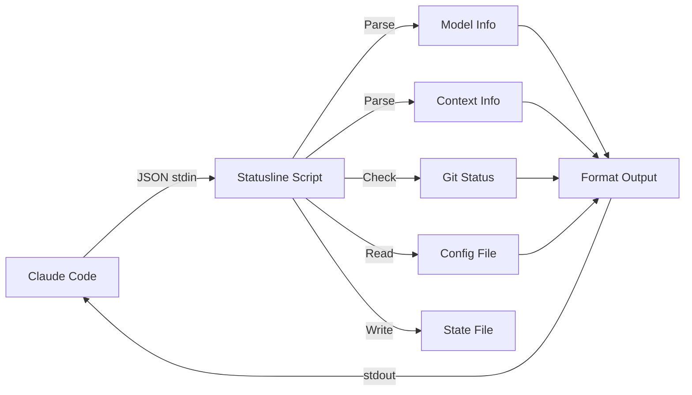

# Available Scripts

## Overview

| Script                  | Platform     | Requirements | State Writes | Features                          |
| ----------------------- | ------------ | ------------ | ------------ | --------------------------------- |
| `statusline-full.sh`    | macOS, Linux | `jq`         | No           | Full-featured with all indicators |
| `statusline-git.sh`     | macOS, Linux | `jq`         | No           | Git branch and changes            |
| `statusline-minimal.sh` | macOS, Linux | `jq`         | No           | Model + directory only            |
| `statusline.py`         | All          | Python 3     | Yes          | Cross-platform, full-featured     |
| `statusline.js`         | All          | Node.js 18+  | Yes          | Cross-platform, full-featured     |
| `context-stats.sh`      | macOS, Linux | Bash         | No           | Token usage visualization (CLI)   |

## Installation Methods

| Method | Statusline Command | Context Stats Command |
| ------ | ------------------ | --------------------- |
| `pip install cc-context-stats` | `claude-statusline` | `context-stats` |
| `npm install -g cc-context-stats` | `claude-statusline` | `context-stats` |
| Shell installer (`install.sh`) | `~/.claude/statusline.sh` | `~/.local/bin/context-stats` |

## Bash Scripts

### statusline-full.sh (Recommended for bash users)

Complete status line with all features:

- Model name
- Current directory
- Git branch and changes
- Token usage with color coding
- Token delta tracking
- Autocompact indicator
- Session ID

> **Note:** Does not write state files. For context-stats CLI support, use the Python or Node.js script instead.

### statusline-git.sh

Lighter version with git info:

- Model name
- Current directory
- Git branch and changes

### statusline-minimal.sh

Minimal footprint:

- Model name
- Current directory

## Cross-Platform Scripts

### statusline.py

Python implementation matching `statusline-full.sh` functionality. Works on Windows, macOS, and Linux without additional dependencies beyond Python 3.

Features beyond bash scripts:
- Writes state files for context-stats CLI
- Duplicate-entry deduplication
- State file rotation (10k/5k threshold)
- 5-second git command timeout

### statusline.js

Node.js implementation matching `statusline-full.sh` functionality. Works on all platforms with Node.js 18+ installed.

Features beyond bash scripts:
- Writes state files for context-stats CLI
- Duplicate-entry deduplication
- State file rotation (10k/5k threshold)
- 5-second git command timeout

## Utility Scripts

### context-stats.sh

Standalone bash CLI tool for visualizing token consumption. Reads state files written by the Python or Node.js statusline scripts. See [Context Stats](context-stats.md) for details.

## Output Format

All statusline scripts produce consistent output:

```
[Model] directory | branch [changes] | XXk free (XX%) [+delta] [AC:XXk] session_id
```

## Architecture



## Input Format

Scripts receive JSON via stdin from Claude Code:

```json
{
  "model": {
    "display_name": "Opus 4.5"
  },
  "cwd": "/path/to/project",
  "session_id": "abc123",
  "context": {
    "tokens_remaining": 64000,
    "context_window": 200000,
    "autocompact_buffer_tokens": 45000
  }
}
```

## Color Codes

All scripts use consistent ANSI colors (defaults, overridable via `~/.claude/statusline.conf`):

| Color   | Code         | Usage                      | Config Key      |
| ------- | ------------ | -------------------------- | --------------- |
| Blue    | `\033[0;34m` | Directory                  | `color_blue`    |
| Magenta | `\033[0;35m` | Git branch                 | `color_magenta` |
| Cyan    | `\033[0;36m` | Changes count              | `color_cyan`    |
| Green   | `\033[0;32m` | High availability (>50%)   | `color_green`   |
| Yellow  | `\033[0;33m` | Medium availability (>25%) | `color_yellow`  |
| Red     | `\033[0;31m` | Low availability (<=25%)   | `color_red`     |
| Dim     | `\033[2m`    | Model, AC indicator        | —               |
| Reset   | `\033[0m`    | Reset formatting           | —               |

See [Configuration](configuration.md#custom-colors) for details on overriding colors with named colors or hex codes.
