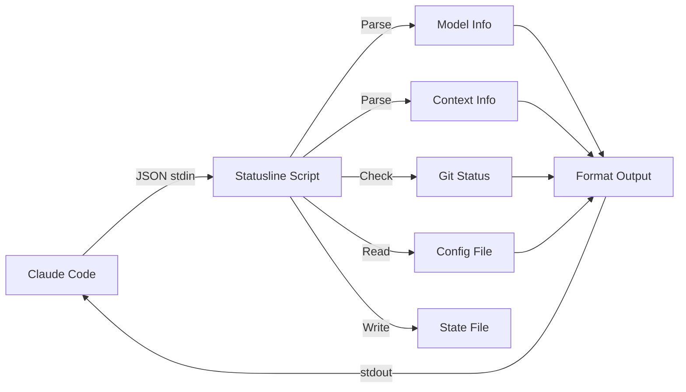

# Available Scripts

## Overview

| Script             | Platform | Requirements | State Writes | Features                      |
| ------------------ | -------- | ------------ | ------------ | ----------------------------- |
| `statusline.py`    | All      | Python 3     | Yes          | Cross-platform, full-featured |
| `context-stats.sh` | macOS, Linux | Bash     | No           | Token usage visualization (CLI) |

## Installation Methods

| Method | Statusline Command | Context Stats Command |
| ------ | ------------------ | --------------------- |
| `pip install cc-context-stats` | `claude-statusline` | `context-stats` |

## statusline.py

Python implementation. Works on Windows, macOS, and Linux without additional dependencies beyond Python 3.

Features:
- Writes state files for context-stats CLI
- Duplicate-entry deduplication
- State file rotation (10k/5k threshold)
- Model Intelligence (MI) with per-model profiles
- 5-second git command timeout

## Utility Scripts

### context-stats.sh

Standalone bash CLI tool for visualizing token consumption. Reads state files written by the Python statusline script. See [Context Stats](context-stats.md) for details.

## Output Format

```
[Model] directory | branch [changes] | XXk free (XX%) [+delta] MI:0.XXX [AC:XXk] session_id
```

## Architecture



## Input Format

Scripts receive JSON via stdin from Claude Code:

```json
{
  "model": {
    "display_name": "Opus 4.5"
  },
  "cwd": "/path/to/project",
  "session_id": "abc123",
  "context": {
    "tokens_remaining": 64000,
    "context_window": 200000,
    "autocompact_buffer_tokens": 45000
  }
}
```

## Color Codes

The script uses consistent ANSI colors (defaults, overridable via `~/.claude/statusline.conf`):

### Per-Property Colors

Each statusline element has its own configurable color with a fallback chain:

| Element          | Default          | Config Key             | Fallback          |
| ---------------- | ---------------- | ---------------------- | ----------------- |
| Context length   | Bold White       | `color_context_length` | MI-based color    |
| Project name     | Cyan             | `color_project_name`   | `color_blue`      |
| Git branch       | Green            | `color_branch_name`    | `color_magenta`   |
| MI score         | Yellow           | `color_mi_score`       | MI-based color    |
| Zone indicator   | (zone color)     | `color_zone`           | Dynamic zone color|
| Separator/dim    | Dim              | `color_separator`      | —                 |

### Base Colors

| Color      | Code              | Usage                    | Config Key      |
| ---------- | ----------------- | ------------------------ | --------------- |
| Cyan       | `\033[0;36m`      | Changes count            | `color_cyan`    |
| Green      | `\033[0;32m`      | MI-based (good)          | `color_green`   |
| Yellow     | `\033[0;33m`      | MI-based (warning)       | `color_yellow`  |
| Red        | `\033[0;31m`      | MI-based (critical)      | `color_red`     |
| Bold White | `\033[1;97m`      | Context length default   | —               |
| Dim        | `\033[2m`         | Separator default        | —               |
| Reset      | `\033[0m`         | Reset formatting         | —               |

See [Configuration](configuration.md#custom-colors) for details on overriding colors with named colors or hex codes.
