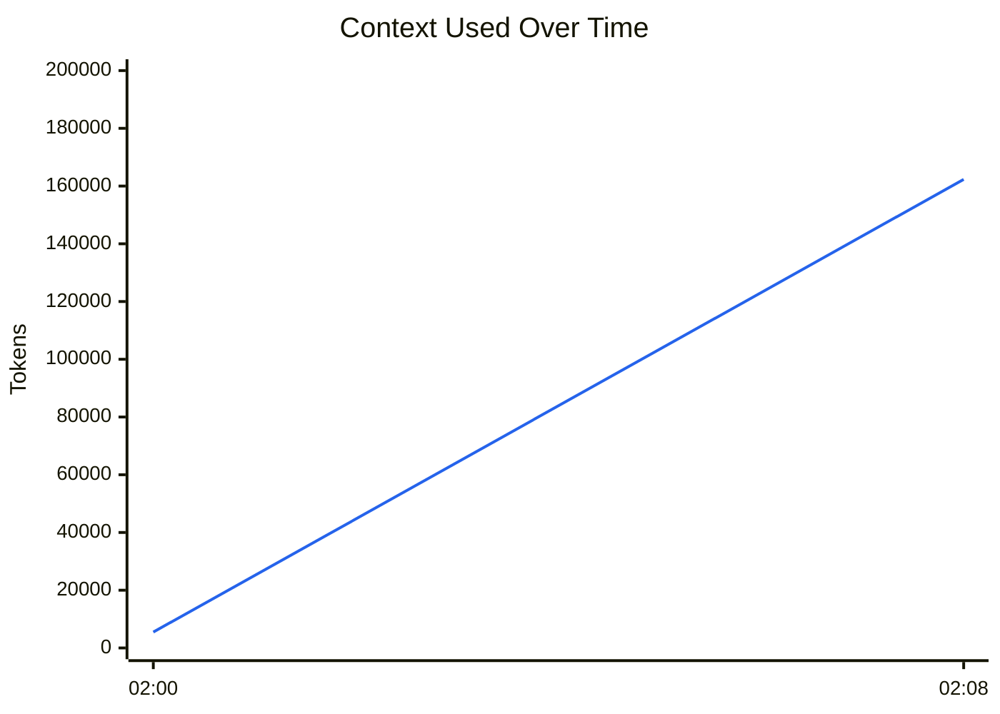
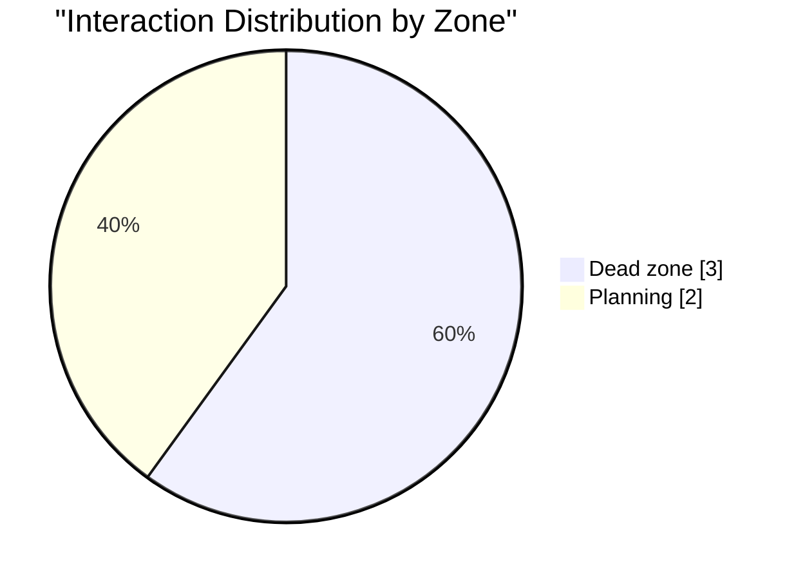
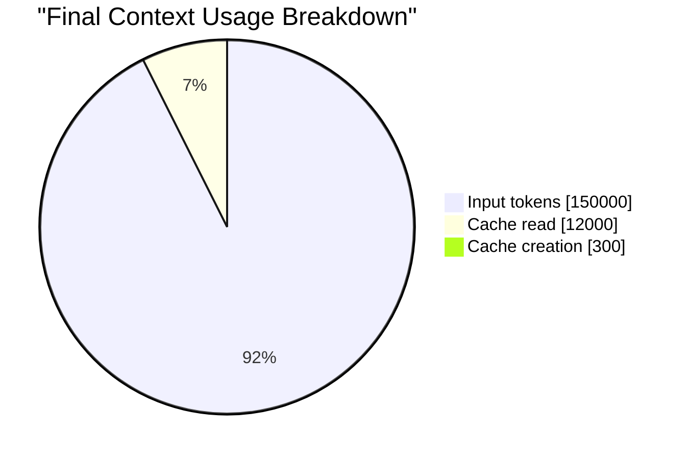
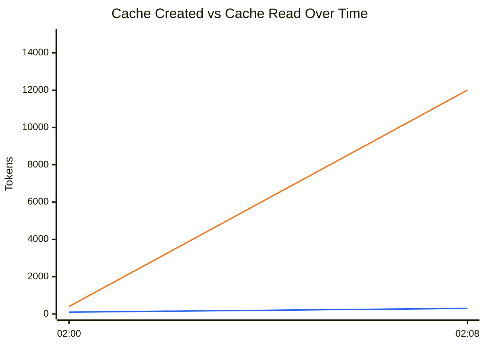

# Context Stats Report

## Generate

```bash
context-stats export golden-export-session --output report.md
```

## Executive Snapshot

| Signal | Value | Why it matters |
|--------|-------|----------------|
| **Session** | `golden-export-session` | Lets you link this export back to the source interaction stream. |
| **Project** | **alpha** | Identifies where the report came from. |
| **Model** | **claude-opus** | Shows which model produced the session. |
| **Duration** | **8m 0s** | Helps you relate context growth to session length. |
| **Report span** | **2025-06-15 02:00:00 -> 2025-06-15 02:08:00** | Gives the exact time range covered by the export. |
| **Interactions** | **5** | Shows how active the session was overall. |
| **Produced by** | **context-stats v1.25.0** | Shows which tool generated the report. |
| **Generated** | **2026-06-15 12:00:00** | Records when the report was produced. |
| **Final usage** | **162,300** (81.2%) | Shows how close the session ended to the context limit. |
| **Final zone** | **Dead zone** | Indicates whether the session stayed in a safe working range. |
| **Recommendation** | Start a new session with `/clear` | Suggested next action based on context zone. |
| **Cache activity** | **12,300** (7.6%) | Explains how much of the final context is cache-related. |

## Summary

| Metric | Value |
|--------|-------|
| Context window | 200,000 tokens |
| Final usage | 162,300 (81.2%) |
| Total input tokens | 300,000 |
| Total output tokens | 1,400 |
| Session cost | $2.4000 |
| Final MI score | 0.313 (Dead zone) |

### Context Usage

**Context usage:** `████████████████░░░░` 81.2%

## Key Takeaways

- **Final state:** 162,300 used (81.2%) and currently in the **Dead zone**.
- **Growth:** context increased by 156,800 tokens over 8m 0s (78.4% of the window).
- **Largest jump:** 141,500 tokens at interaction #3.
- **Dominant zone:** **Dead zone** for 3 of 5 interactions.
- **Cache load:** 12,300 tokens in cache activity (7.6% of the final used context).
- **Cache pattern:** cache reads outweighed creation, so the session reused prior work heavily.

## Visual Summary

### Context Trend

Shows how much context was used at each sampled point so you can spot growth, resets, and sudden jumps.



### Zone Distribution

Shows where the session spent most of its time relative to the context window, which highlights whether the conversation stayed in a safe range or drifted into heavier usage.



### Final Context Composition

Shows what made up the last request in the session, which helps explain whether the final context was mostly fresh input, cache reuse, or newly created cache.



### Cache Activity Trend

Shows how cache creation and cache reads evolved over time so you can see when the session started reusing previous work versus building new cache.



- Legend: blue line = `Cache creation`, orange line = `Cache read`.

## Interaction Timeline

| # | Time | Input (req) | Output (req) | Context Used | Usage % | MI | Zone |
|---|------|-------------|--------------|--------------|---------|------|------|
| 1 | 02:00:00 | 5,000 | 300 | 5,500 | 2.8% | 0.998 | Plan |
| 2 | 02:02:00 | 25,000 | 800 | 35,500 | 17.8% | 0.955 | Plan |
| 3 | 02:04:00 | 95,000 | 1,200 | 177,000 | 88.5% | 0.197 | Dead |
| 4 | 02:06:00 | 140,000 | 900 | 170,500 | 85.2% | 0.250 | Dead |
| 5 | 02:08:00 | 150,000 | 700 | 162,300 | 81.2% | 0.313 | Dead |

## Context Growth

- **Starting context:** 5,500 tokens
- **Final context:** 162,300 tokens
- **Total growth:** 156,800 tokens
- **Largest single jump:** 141,500 tokens (interaction #3)

## Cache Statistics

| # | Time | Cache Create | Cache Read |
|---|------|--------------|------------|
| 1 | 02:00:00 | 100 | 400 |
| 2 | 02:02:00 | 1,500 | 9,000 |
| 3 | 02:04:00 | 2,000 | 80,000 |
| 4 | 02:06:00 | 500 | 30,000 |
| 5 | 02:08:00 | 300 | 12,000 |

---
*Generated by [context-stats](https://github.com/luongnv89/context-stats) v1.25.0*
