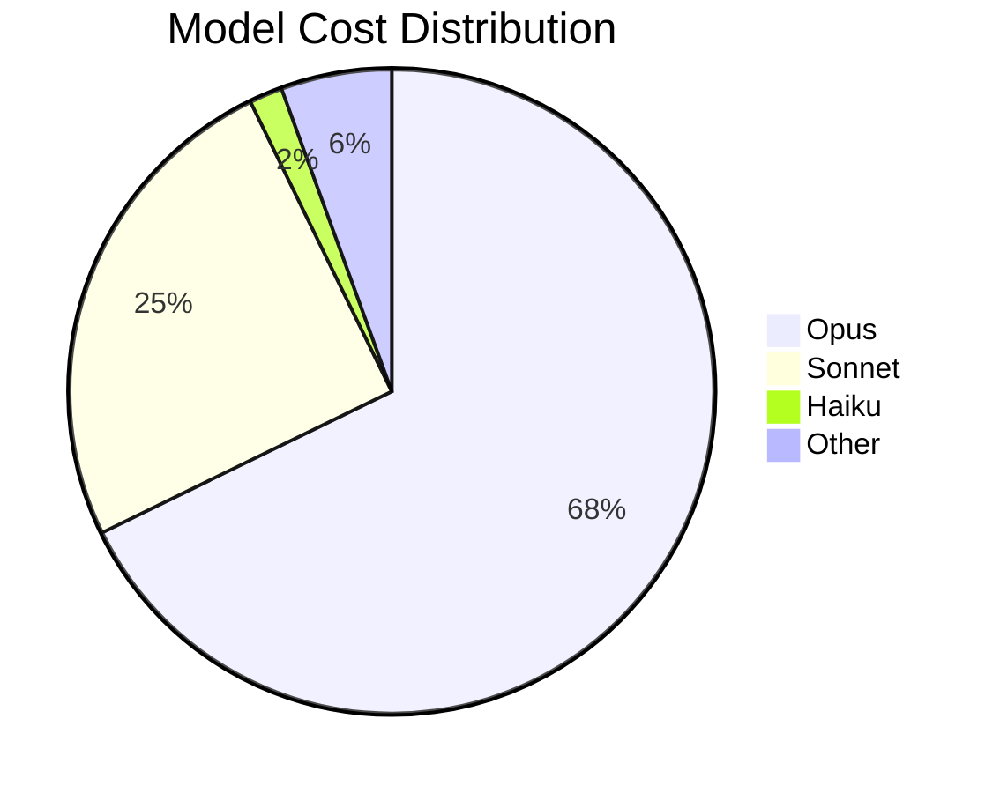
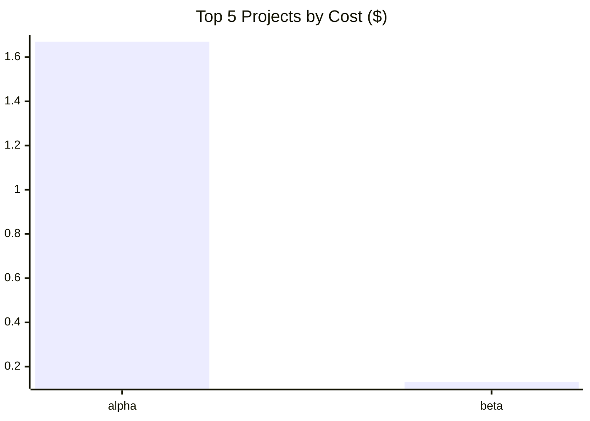
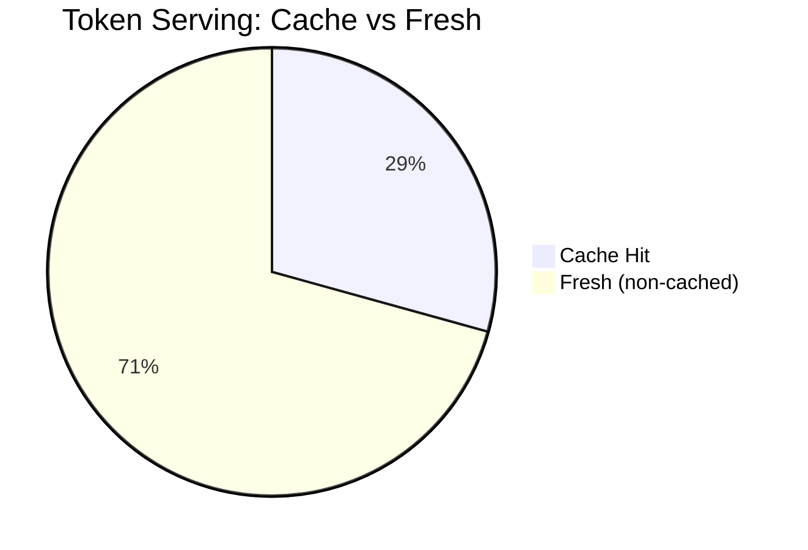
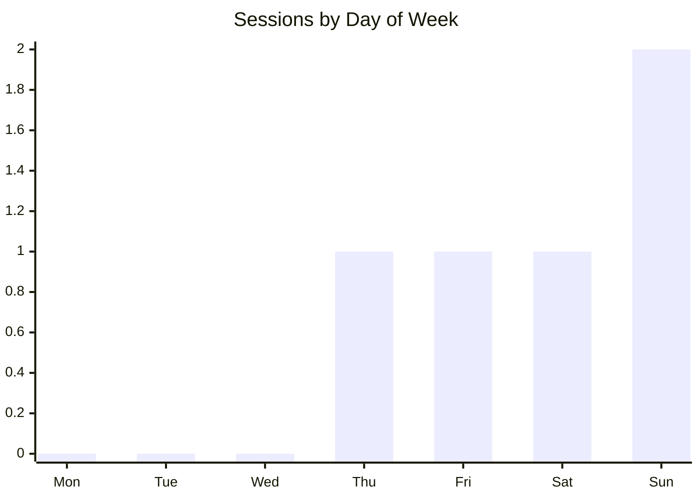
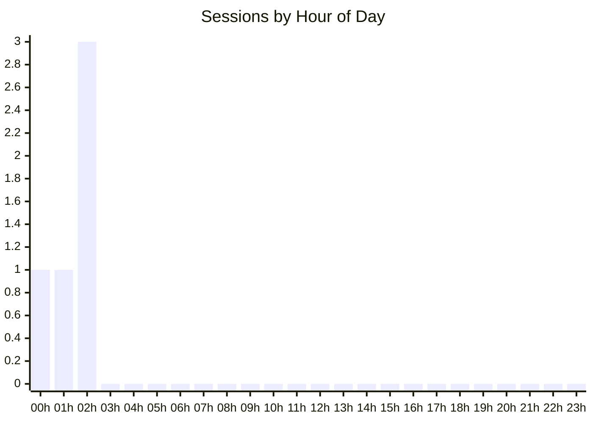
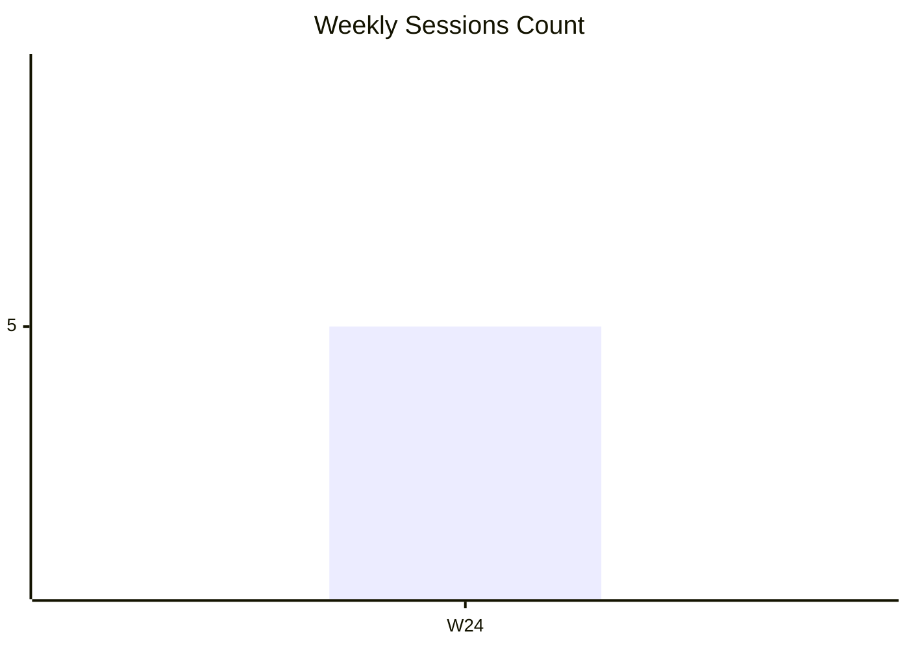

# Token Usage Analytics Report

Generated: 2026-06-15 12:00:00
Period: 2025-06-12 → 2025-06-15
Source: context-stats v1.24.0

## Executive Summary

| Metric | Value |
|--------|-------|
| Report Period | 2025-06-12 → 2025-06-15 |
| Total Spend | $1.80 |
| Total Sessions | 5 |
| Projects Analyzed | 2 |
| Cache Hit Ratio | 29.3% |
| Avg Session Cost | $0.36 |
| Avg Session Duration | 32m 40s |
| Most Expensive Session | a1b2c3d4... ($1.20, 66.7% of total) |
| Most Expensive Project | /home/user/alpha ($1.67, 92.8% of total) |

## Model Usage Breakdown



| Model Family | Sessions | Total Tokens | Cost | % of Total Cost |
|---|---|---|---|---|
| opus | 2 | 113,130 | $1.22 | 67.8% |
| sonnet | 1 | 50,000 | $0.45 | 25.0% |
| haiku | 1 | 91,200 | $0.03 | 1.7% |
| other | 1 | 16,000 | $0.10 | 5.6% |

## Cost Optimization Analysis

### Key Findings

- **Test/Fake Sessions**: 1 sessions consuming $0.02 (1.1% of total) — recommend removing from production analysis

- **Real Sessions**: 4 sessions costing $1.78
- **Cache Hit Ratio**: 29.4% (room for improvement if <70%)

- **Cost per 1k tokens**: $0.007

### Top Cost Drivers (Top 10 Sessions)
| Session | Project | Cost | Cache % | Duration | Input | Output |
|---------|---------|------|---------|----------|-------|--------|
| a1b2c3d4... | alpha | $1.20 | 53% | 1h 0m 0s | 40,000 | 8,000 |
| b2c3d4e5... | alpha | $0.45 | 36% | 30m 0s | 25,000 | 5,000 |
| d4e5f6a1... | beta | $0.10 | 6% | 1h 0m 0s | 12,000 | 2,500 |
| c3d4e5f6... | beta | $0.03 | 0% | 10m 0s | 90,000 | 900 |
| test-fak... | alpha | $0.02 | 1% | 3m 20s | 1,000 | 100 |

### Optimization Opportunities

2. **Sessions with low cache efficiency** (avg 3%)
   - These sessions could benefit most from optimized prompts:

     - c3d4e5f6... (beta): 0% cache hit
     - d4e5f6a1... (beta): 6% cache hit

3. **Model efficiency by family**
   | Model | Sessions | $/1k tokens |
   |-------|----------|-------------|
   | haiku | 1 | $0.000 |
   | opus | 2 | $0.011 |
   | other | 1 | $0.006 |
   | sonnet | 1 | $0.009 |

4. **High-spend projects to review**
   | Project | Sessions | Cost | Cache Hit % |
   |---------|----------|------|-------------|
   | alpha | 3 | $1.67 | 48% |
   | beta | 2 | $0.13 | 1% |



## Cost Efficiency



- **Overall cache efficiency**: 29.3% of tokens served from cache
- **Average tokens per dollar**: 150183 tokens/$

### Top 5 Most Efficient Sessions (lowest $/1k tokens)
|  Session | Project | $/1k tokens | Cost | Tokens |
|---|---|---|---|---|
| c3d4e5f6... | beta | $0.000 | $0.03 | 91,200 |
| d4e5f6a1... | beta | $0.006 | $0.10 | 16,000 |
| b2c3d4e5... | alpha | $0.009 | $0.45 | 50,000 |
| a1b2c3d4... | alpha | $0.011 | $1.20 | 112,000 |
| test-fak... | alpha | $0.018 | $0.02 | 1,130 |

### Top 5 Least Efficient Sessions (highest $/1k tokens)
| Session | Project | $/1k tokens | Cost | Tokens |
|---|---|---|---|---|
| test-fak... | alpha | $0.018 | $0.02 | 1,130 |
| a1b2c3d4... | alpha | $0.011 | $1.20 | 112,000 |
| b2c3d4e5... | alpha | $0.009 | $0.45 | 50,000 |
| d4e5f6a1... | beta | $0.006 | $0.10 | 16,000 |
| c3d4e5f6... | beta | $0.000 | $0.03 | 91,200 |

## Daily Activity Heatmap



### Sessions by Day of Week
| Day | Count | Activity |
|-----|-------|----------|
| Mon | 0 | .................... |
| Tue | 0 | .................... |
| Wed | 0 | .................... |
| Thu | 1 | ##########.......... |
| Fri | 1 | ##########.......... |
| Sat | 1 | ##########.......... |
| Sun | 2 | #################### |



### Sessions by Hour of Day
| Hour | Count | Activity |
|------|-------|----------|
| 00 | 1 | #######............. |
| 01 | 1 | #######............. |
| 02 | 3 | #################### |
| 03 | 0 | .................... |
| 04 | 0 | .................... |
| 05 | 0 | .................... |
| 06 | 0 | .................... |
| 07 | 0 | .................... |
| 08 | 0 | .................... |
| 09 | 0 | .................... |
| 10 | 0 | .................... |
| 11 | 0 | .................... |
| 12 | 0 | .................... |
| 13 | 0 | .................... |
| 14 | 0 | .................... |
| 15 | 0 | .................... |
| 16 | 0 | .................... |
| 17 | 0 | .................... |
| 18 | 0 | .................... |
| 19 | 0 | .................... |
| 20 | 0 | .................... |
| 21 | 0 | .................... |
| 22 | 0 | .................... |
| 23 | 0 | .................... |

## Weekly Activity Trend

```mermaid
xychart-beta
    title "Weekly Spend ($)"
    x-axis ["W24"]
    line [1.80]
```



| Week | Sessions | Cost | Tokens | Spend Bar |
|------|----------|------|--------|-----------|
| 2025-W24 | 5 | $1.80 | 270,330 | #################### |

## Code Productivity

> Based on 2 sessions with git activity data.

- **Total lines changed**: 202 (+165 / -37)
- **Lines per dollar**: 155 lines/$
- **Lines per 1k tokens**: 1.6 lines/1k tokens

### Top 5 Projects by Lines/$ Efficiency
| Project | Lines Changed | Cost | Lines/$ |
|---------|--------------|------|---------|
| beta | 52 | $0.10 | 520 |
| alpha | 150 | $1.20 | 125 |

## Projects

| # | Project | Sessions | Cost | % Total | Tokens | Cache Hit % | Avg Cost | Dominant Model |
|---|---------|----------|------|---------|--------|-------------|----------|----------------|
| 1 | alpha | 3 | $1.67 | 92.8% | 163,130 | 47.8% | $0.56 | opus |
| 2 | beta | 2 | $0.13 | 7.2% | 107,200 | 1.1% | $0.07 | haiku |

---
*Report generated by context-stats*